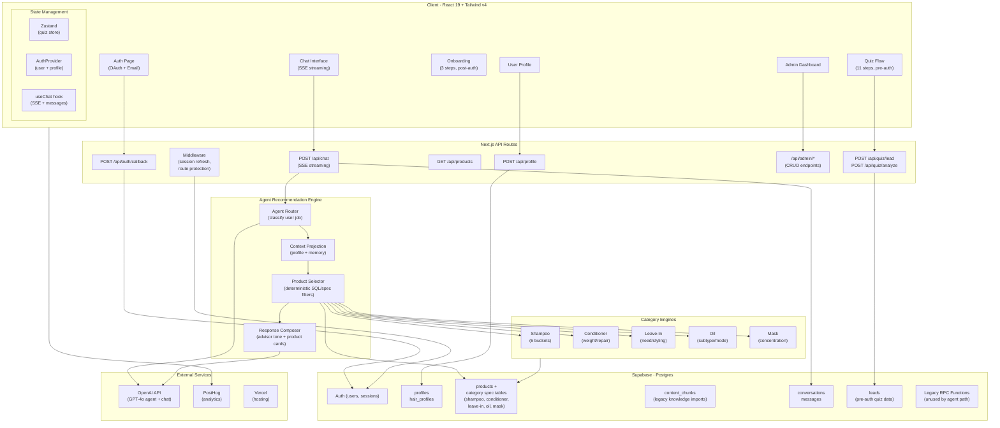
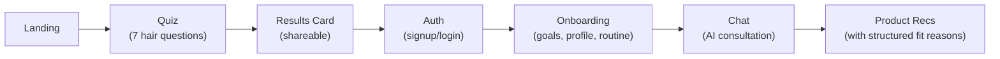
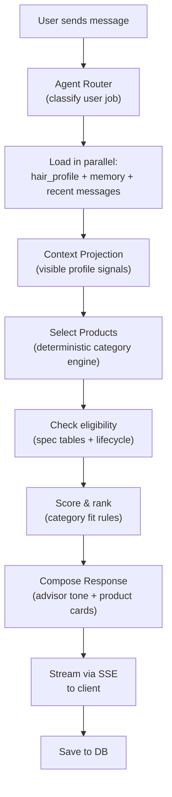
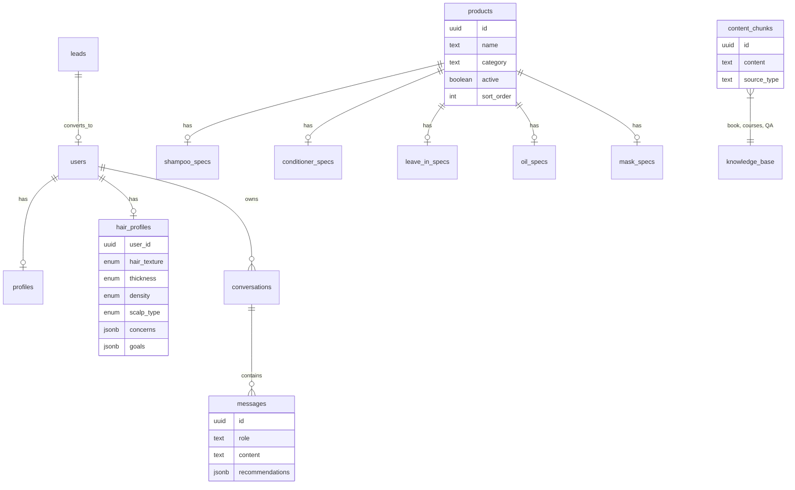

# Hair Concierge — Architecture Overview

## What It Is

A personalized AI hair care recommendation platform built around profile-aware diagnostics, deterministic recommendation logic, and contextual AI guidance. Users take a diagnostic quiz, complete a post-auth onboarding to build a detailed hair profile, then receive product recommendations and hair care advice via a conversational AI chat.

**Target:** German-speaking hair care enthusiasts. All UI text is in German.

---

## Tech Stack

| Layer | Tech |
|-------|------|
| Framework | Next.js 16 (React 19, TypeScript 5, App Router) |
| Database | Supabase PostgreSQL |
| Auth | Supabase Auth (OAuth + email) |
| AI/LLM | OpenAI GPT-4o (agent routing, response composition) |
| Styling | Tailwind CSS 4 + shadcn/ui |
| State | Zustand |
| Analytics | PostHog |
| E2E Tests | Playwright |
| Deployment | Vercel |

---

## System Architecture



---

## User Journey



### Flow Details

1. **Quiz** (pre-auth) — 7-question hair diagnostic covering texture, thickness, cuticle condition, protein-moisture balance, scalp type, chemical treatments, and goals
2. **Lead capture** — name + email stored in `leads` table
3. **Auth** — Supabase OAuth (Google, etc.) + email signup; lead data linked to new user
4. **Onboarding** (post-auth) — additional profile fields: wash frequency, goals, density, mechanical stress
5. **Chat** — streaming SSE responses, agent-routed, advisor-style guidance

---

## Agent Recommendation Pipeline

The core intelligence of the app. Each product-recommendation message flows through this pipeline:



### Recommendation Engine (Per Category)

Each product category follows a 3-stage pipeline:

1. **Decision Builder** — checks eligibility, infers derived fields from profile (e.g., `scalp_type` → `shampoo_bucket`)
2. **Product Matcher** — deterministic SQL/spec filters over active products and category eligibility tables
3. **Reranker** — category-specific scoring rules, returns top results with reasons and usage hints

**Categories:** Shampoo (6 buckets), Conditioner (weight/repair levels), Leave-in (need bucket/styling context), Oil (subtype/use mode), Mask (concentration/dosing)

---

## Data Model



---

## Key Directories

```
src/
├── app/                    # Next.js App Router
│   ├── api/chat/           # Chat SSE streaming endpoint
│   ├── api/quiz/           # Quiz analysis + lead capture
│   ├── api/admin/          # Admin CRUD endpoints
│   ├── quiz/               # Quiz UI
│   ├── auth/               # Login/signup
│   ├── onboarding/         # Post-auth profile collection
│   ├── chat/               # Chat interface
│   ├── profile/            # User settings
│   ├── admin/              # Admin dashboard
│   └── result/[leadId]/    # Public shareable result card
│
├── components/
│   ├── ui/                 # shadcn/ui primitives (25+ components)
│   ├── quiz/               # Quiz-specific components (13 files)
│   ├── chat/               # Chat components (9 files)
│   ├── onboarding/         # Onboarding steps (4 files)
│   └── admin/              # Admin panel components
│
├── lib/
│   ├── agent/              # Production agent routing + tools
│   ├── rag/                # Legacy chat helpers + compatibility traces
│   ├── quiz/               # Quiz state, questions, normalization
│   ├── supabase/           # DB clients (browser, server, admin)
│   ├── openai/             # LLM client wrappers
│   ├── vocabulary/         # Centralized German labels (single source of truth)
│   ├── validators/         # Zod schemas
│   └── {shampoo,conditioner,leave-in,oil,mask}/  # Category constants
│
├── hooks/                  # useChat, useHairProfile
├── providers/              # AuthProvider, PostHog, Toast
└── middleware.ts           # Route protection + session refresh

supabase/
└── migrations/             # 35+ SQL migrations (schema, RPC functions, RLS)

data/
└── markdown-cleaned/       # Legacy knowledge imports
```

---

## Design Decisions

| Decision | Rationale |
|----------|-----------|
| **Deterministic product matching** (not pure LLM) | Category-specific rules ensure consistent, explainable recommendations |
| **No embedding fallback for product fit** | Safety, lifecycle, and fit come from explicit category rules and catalog data |
| **Category-specific spec tables** (not generic JSON) | Type-safe, queryable product attributes per category |
| **Pre-auth quiz → post-auth onboarding** | Low-friction entry; captures lead before requiring signup |
| **SSE streaming** (not WebSockets) | Simpler, works with Vercel edge, progressive response display |
| **German-only UI with centralized vocabulary** | Single source of truth in `src/lib/vocabulary/` |
| **Zustand** (not Redux/Context) | Lightweight, minimal boilerplate for quiz + chat state |

---

## Current Status (May 2026)

**Done:** Quiz, auth, agent-routed streaming chat, deterministic product recommendations, admin panel, mechanical stress onboarding

**In progress:** Onboarding finalization, shareable diagnosis card (Instagram Story format), routine recommendation design spec, chat photo upload disabled for launch

**Planned:** Cross-category routine engine, paywall enforcement, Stripe integration, barcode scanner, seasonal refresh notifications
