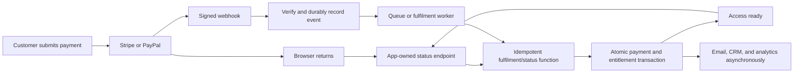

# Web App Latency and Post-Payment Best Practices

**Research date:** 2026-08-13<br>
**Scope:** General best practices for a Next.js App Router application on Vercel, backed by Supabase/Postgres and using Stripe- and PayPal-style payment providers.<br>
**Status:** General research complete; no Chaarlie implementation comparison has been performed.

## Methodology and evidence boundary

The research was completed in four independent evidence lanes:

1. payment-provider architecture and post-payment fulfilment;
2. Next.js and Vercel application performance;
3. Supabase/Postgres latency and concurrency;
4. post-payment UX, resilience, accessibility, and observability.

Primary, current sources were preferred: Stripe, PayPal, Next.js, Vercel, Supabase, PostgreSQL, web.dev, W3C, OpenTelemetry, and Google SRE documentation.

This report separates:

- **documented provider/platform requirements**, which are linked to primary sources; and
- **proposed engineering targets and architecture synthesis**, which are explicitly labelled as recommendations rather than vendor guarantees.

No repository code, runtime configuration, database, production telemetry, or current Chaarlie implementation was inspected for this report.

## Executive conclusion

The strongest post-payment architecture is a dual-path design:

- The **webhook path** guarantees that every successful payment is fulfilled even if the customer closes the browser.
- The **browser-return path** gives the customer immediate feedback and can invoke the same idempotent server-side fulfilment/status logic to avoid waiting unnecessarily for a webhook.
- Both paths converge on one durable payment ledger and one atomic entitlement operation.
- The return page never grants access merely because the browser reached a success URL.

A fast experience therefore depends on three separate properties:

1. **Fast rendering:** the customer sees a stable confirmation surface immediately.
2. **Fast convergence:** authoritative payment state becomes usable entitlement quickly.
3. **Durable correctness:** retries, duplicate events, browser closures, and provider delays cannot lose a payment or grant access twice.



## 1. Post-payment architecture

### Establish a durable purchase identity before payment

Before redirecting or opening a payment provider, create an application-owned order or payment-attempt record containing:

- immutable attempt/order ID;
- customer and product/package identity;
- expected amount and currency;
- provider name;
- provider Session, PaymentIntent, Order, or Capture ID;
- idempotency key;
- current payment state;
- entitlement/fulfilment state;
- timestamps and correlation identifiers.

This record connects the browser, provider calls, webhooks, database writes, and support investigation.

Provider calls that might be retried must use provider-side idempotency. Stripe supports `Idempotency-Key`; PayPal uses `PayPal-Request-Id`. A timeout must mean “outcome unknown—retrieve or retry safely,” not “create another payment.”

Sources: [Stripe idempotent requests](https://docs.stripe.com/api/idempotent_requests), [PayPal idempotency](https://developer.paypal.com/reference/guidelines/idempotency)

### Keep payment truth and entitlement truth separate

Use two related state machines.

Payment truth might be:

- `created`
- `requires_action`
- `processing`
- `paid`
- `failed`
- `cancelled`
- `refunded` or `reversed`

Entitlement truth might be:

- `not_ready`
- `provisioning`
- `ready`
- `revoked`
- `failed_needs_reconciliation`

This exposes the dangerous condition `paid + not_ready` rather than hiding it behind a generic “success” flag.

### Treat the webhook as the reliability authority

Stripe explicitly says the landing page cannot be the only fulfilment mechanism because a customer may pay and never reach it. PayPal likewise exposes authoritative capture events independently of browser completion.

Sources: [Stripe fulfilment](https://docs.stripe.com/checkout/fulfillment?payment-ui=embedded-form), [PayPal checkout webhooks](https://developer.paypal.com/payment-methods/webhooks)

The webhook ingress should:

1. preserve the raw request body;
2. verify the provider signature;
3. reject unverifiable messages;
4. durably store the event or successfully place it onto a durable queue;
5. return `2xx` quickly;
6. perform complex fulfilment outside the ingress response.

Do not acknowledge an event before it is durably accepted, but do not hold the response open for email, CRM, analytics, document generation, or other secondary work. Stripe specifically recommends asynchronous processing and a fast `2xx`.

Sources: [Stripe webhook practices](https://docs.stripe.com/webhooks), [PayPal webhook delivery and verification](https://developer.paypal.com/api/rest/webhooks/rest/)

### Make the entire fulfilment path idempotent

Idempotency must exist at several levels:

- provider API request key;
- inbound provider-event ID;
- logical event key such as provider object ID plus event type;
- unique payment/capture identity;
- unique entitlement for order/customer/product;
- idempotent email and downstream job identifiers.

“Already processed” should return the existing successful result. It should not fail or repeat side effects.

Stripe warns that events can be duplicated and are not guaranteed to arrive in order. Provider event ID alone is not always sufficient because distinct Event objects can describe the same logical transition.

Source: [Stripe webhook ordering and duplicates](https://docs.stripe.com/webhooks)

### Commit critical state atomically

The ideal database operation is one short transaction or RPC that:

- inserts the provider-event/idempotency receipt under a unique constraint;
- validates the allowed state transition;
- records authoritative payment state;
- creates or upserts the entitlement;
- writes an outbox record for secondary work;
- returns the resulting entitlement state.

Avoid a chain such as:

```text
check payment -> insert payment -> check entitlement -> create entitlement -> reread entitlement
```

That adds network round trips and creates partial-failure windows.

Provider HTTP calls, email, and analytics should never run while database locks are held.

### Use both browser return and webhook without weakening authority

The return page should call an authenticated application status endpoint. That endpoint may:

- return already committed application state;
- run the same idempotent fulfilment function if provider truth can safely be validated server-side;
- start bounded reconciliation when the local result is still unknown.

Stripe explicitly describes using both redirect-triggered and webhook-triggered fulfilment through the same idempotent function: webhooks provide completeness while the redirect reduces visible delay.

Source: [Stripe fulfilment guide](https://docs.stripe.com/checkout/fulfillment?payment-ui=embedded-form)

The browser itself must never turn a query parameter, redirect, or client callback into entitlement.

### Model delayed payment methods honestly

Not every completed checkout is a completed payment:

- Stripe Checkout can be complete while `payment_status` is not yet paid.
- Stripe delayed methods can remain `processing` and later emit asynchronous success or failure.
- PayPal `CHECKOUT.ORDER.APPROVED` can mean capture is still required.
- PayPal `PAYMENT.CAPTURE.PENDING` explicitly means do not fulfil.
- PayPal `PAYMENT.CAPTURE.COMPLETED` is the fulfilment event.
- PayPal denial or reversal needs a separate recovery path.

Sources: [Stripe PaymentIntent states](https://docs.stripe.com/payments/payment-intents/verifying-status), [Stripe Checkout Session](https://docs.stripe.com/api/checkout/sessions/object), [PayPal checkout events](https://developer.paypal.com/payment-methods/webhooks)

### Add reconciliation as a normal subsystem

Webhooks are retried, but retries are not a complete recovery strategy.

Run a scheduled reconciler that finds:

- payments stuck in `processing`;
- confirmed payments without entitlement;
- failed queue jobs;
- webhook records without completed state transitions;
- provider/local state mismatches.

It should retrieve the canonical provider object and feed it through the same idempotent fulfilment path. Never create a separate manual “force grant” path that bypasses the ledger.

Stripe retries live webhook deliveries for up to three days; PayPal documents up to 25 retries over three days.

Sources: [Stripe webhook retries](https://docs.stripe.com/webhooks), [PayPal webhook retries](https://developer.paypal.com/api/rest/webhooks)

## 2. Recommended post-payment user experience

| Authoritative state | Customer-facing meaning | Recommended behaviour |
| --- | --- | --- |
| Payment submitted | Provider outcome unknown | Disable repeat submission and show immediate neutral progress |
| Requires action | Customer must complete provider/bank action | Explain the required action and preserve resumability |
| Processing | Payment is pending | Say confirmation is still underway; do not claim success or failure |
| Paid, access provisioning | Payment confirmed, entitlement not ready | “Zahlung bestätigt. Dein Zugang wird vorbereitet.” |
| Entitlement ready | Product is usable | Show the actual next action into the product |
| Failed or denied | Provider says payment failed | Offer a safe new attempt |
| Unknown | Network/provider outcome ambiguous | “Bitte nicht erneut zahlen”; continue reconciliation and provide a reference |
| Refunded/reversed | Later lifecycle change | Explain access/refund consequences separately |

Additional UX practices:

- Render the confirmation shell before secondary customer/product data.
- Use a real step/status display, not an endless spinner.
- After roughly 10–15 seconds for an instant method, explain that it is taking longer than usual.
- After 30–60 seconds, expose “Status erneut prüfen,” a reference ID, and a support route while automatic reconciliation continues.
- Preserve the order across back navigation, reload, new tabs, and login/session restoration.
- Do not allow a second payment by default while the first is pending or unknown.
- Use skeletons for product content that is genuinely loading, not for unresolved payment truth.
- Use `role="status"` or a polite live region for progress. Reserve `role="alert"` for important failures.
- Respect reduced-motion preferences; celebratory animation must not delay or obscure access.

Source: [WCAG status-message guidance](https://www.w3.org/WAI/WCAG22/Understanding/status-messages.html)

## 3. Next.js and browser-performance practices

### Keep the application server-first

- Leave pages and layouts as Server Components by default.
- Introduce `'use client'` only at the smallest interactive leaves.
- Fetch first-render data on the server instead of waiting for hydration and `useEffect`.
- Dynamically import optional client libraries and heavy widgets.
- Analyze client and route bundles after material dependency changes.

Sources: [Next.js Server and Client Components](https://nextjs.org/docs/app/getting-started/server-and-client-components), [Next.js lazy loading](https://nextjs.org/docs/app/guides/lazy-loading)

### Eliminate waterfalls

- Start independent reads concurrently with `Promise.all`.
- Retain sequential requests only for genuine dependencies.
- Deduplicate identical render-time reads.
- Start predictable data work early with preload patterns.
- Avoid internal browser-to-route-handler-to-database round trips when a Server Component can read the data directly.
- Keep the critical post-payment status path to one bounded entitlement/status operation.

Source: [Next.js data fetching](https://nextjs.org/docs/app/getting-started/fetching-data)

### Stream around slow, non-critical data

- Use `loading.tsx` for responsive route transitions.
- Put narrow Suspense boundaries around slow sections.
- Return the confirmation shell while recommendations, account history, or other secondary panels stream later.
- Do not stream the authority decision in a way that temporarily renders paid content before authorization completes.

### Cache intentionally

Cache aggressively:

- static pages;
- shared catalog/configuration;
- public images and assets;
- safe, non-user-specific reference data.

Do not broadly cache:

- payment status;
- entitlement-negative results immediately after payment;
- authorization decisions across users;
- provider reconciliation results without correct invalidation.

A stale “no entitlement” cache is particularly harmful immediately after payment. Read replicas have the same issue because replication is asynchronous.

### Preserve fast navigation

- Use `next/link` for internal routes.
- Prefetch high-intent destinations.
- Avoid prefetching enormous or low-intent link collections.
- Do not create provider Sessions merely because a checkout route was prefetched. Payment-resource preparation requires its own explicit-intent gate.
- Give immediate transition feedback with `loading.tsx` or `useLinkStatus`.

Source: [Next.js linking and navigation](https://nextjs.org/docs/app/getting-started/linking-and-navigating)

### Protect the critical rendering path

- Use `next/image`, correct dimensions, and responsive `sizes`.
- Prioritize the actual above-fold LCP image, not every image.
- Use `next/font` and load only required subsets/weights.
- Defer analytics, chat, video, and marketing scripts with `next/script`.
- Keep third-party failures isolated from checkout and confirmation.
- Remove unused CSS and JavaScript.
- Avoid client-rendering meaningful first content where server rendering or prerendering is possible.

## 4. Vercel and infrastructure practices

### Put compute close to the primary data source

Static assets belong on the global CDN. Dynamic payment and entitlement functions should generally run close to the primary database because the function-to-database round trip may occur several times in one request.

Vercel explicitly recommends locating functions near their data source.

Source: [Vercel function regions](https://vercel.com/docs/functions/configuring-functions/region)

Edge is not automatically faster:

- It helps when the downstream data is also globally available or edge-accessible.
- It can be worse when every request must travel from the edge to a single distant database.
- Node remains the safer default for database drivers, Stripe/PayPal SDKs, and full runtime compatibility.

### Use Fluid Compute appropriately

Fluid Compute can reduce cold-start frequency through instance reuse, optimized concurrency, and production prewarming. Initialize reusable clients lazily outside handlers where supported, but never depend on global memory for correctness.

Source: [Vercel Fluid Compute](https://vercel.com/docs/fluid-compute)

Use `waitUntil` for non-critical best-effort post-response work when appropriate. Money-critical fulfilment and reconciliation require a durable queue/outbox, not `waitUntil` as their only persistence mechanism.

### Bound external dependencies

For provider, database, and downstream calls:

- set explicit deadlines;
- retry only idempotent operations;
- use bounded exponential backoff with jitter;
- stop retrying permanent validation/authentication failures;
- distinguish timeout/unknown from confirmed failure;
- prevent retries from exceeding the customer-facing latency budget;
- monitor external API latency separately.

Increasing a function’s maximum duration is a failure-boundary adjustment, not a latency fix.

## 5. Supabase/Postgres practices

### Use the correct connection mode

For short-lived/serverless functions, Supabase recommends transaction pooling. Direct connections suit persistent servers and administrative operations; session pooling is primarily for persistent IPv4-only clients. Transaction mode does not support prepared statements.

Source: [Supabase connection methods](https://supabase.com/docs/guides/database/connecting-to-postgres)

### Optimize the actual query shapes

- Index payment provider IDs and idempotency keys.
- Index entitlement lookup columns.
- Index foreign keys, join columns, and common filters.
- Index columns used by RLS predicates.
- Use composite or partial indexes only where the real query benefits.
- Avoid `select *` and return only needed columns.
- Verify indexes through `EXPLAIN`; remove unused speculative indexes.
- Monitor aggregate query behaviour with `pg_stat_statements`.

Sources: [Supabase query optimization](https://supabase.com/docs/guides/database/query-optimization), [Supabase `pg_stat_statements`](https://supabase.com/docs/guides/database/extensions/pg_stat_statements)

### Keep RLS safe and efficient

- Keep RLS enabled on exposed data.
- Use ownership predicates, not merely `TO authenticated`.
- Wrap stable helpers as `(select auth.uid())` where applicable so they can be evaluated once per statement.
- Index policy predicate columns.
- Do not use user-editable metadata for authorization.
- Never expose service-role or database credentials to the browser.

Source: [Supabase RLS guidance](https://supabase.com/docs/guides/database/postgres/row-level-security)

### Avoid replicas for immediate post-payment confirmation

Supabase read replicas are asynchronous and can lag the primary. They are useful for global read latency and workload isolation, but the payment write and immediate entitlement read should remain on the primary.

Source: [Supabase read replicas](https://supabase.com/docs/guides/platform/read-replicas)

Realtime or SSE may accelerate UI convergence, but must not become the source of payment truth. Bounded polling against the application’s authoritative status endpoint remains the simplest correctness fallback.

## 6. Observability

Use stable correlation identifiers across:

- browser session;
- application order/payment attempt;
- provider Session/Intent/Order/Capture;
- provider webhook event;
- webhook delivery attempt;
- fulfilment job;
- entitlement transaction;
- notification;
- deployment version;
- OpenTelemetry trace.

Important spans/events include:

- payment submission;
- provider resource creation;
- provider UI ready;
- confirmation started;
- provider outcome;
- return page loaded;
- webhook received and verified;
- event durably accepted;
- payment-state transition;
- entitlement write;
- access first usable;
- email/notification completed.

Distributed tracing should show the complete path from Vercel routing through functions, external provider calls, and database operations.

Sources: [Vercel tracing](https://vercel.com/docs/tracing), [OpenTelemetry context propagation](https://opentelemetry.io/docs/concepts/context-propagation/)

Segment performance by:

- provider and payment-method class;
- instant versus delayed methods;
- device and browser;
- ordinary browser versus in-app browser;
- country/region;
- mobile and desktop;
- new versus returning customer;
- cold versus warm function;
- deployment/version.

Report p50, p75, p95, and p99. Averages conceal the customers experiencing the worst payment delays.

## 7. Performance and reliability targets

### Externally established targets

At the 75th percentile, separately for mobile and desktop:

- LCP: <= 2.5 seconds
- INP: <= 200 milliseconds
- CLS: <= 0.1
- TTFB: approximately <= 800 milliseconds as a useful diagnostic target

Sources: [Core Web Vitals](https://web.dev/articles/vitals), [TTFB guidance](https://web.dev/articles/optimize-ttfb)

Stripe and PayPal do not offer a universal webhook-arrival or end-to-end entitlement-latency guarantee. Payment-method settlement time must be measured separately from application fulfilment latency.

### Proposed starting SLOs

These are engineering starting points, not provider guarantees:

| Measurement | Starting target |
| --- | ---: |
| Payment-submit API acknowledgement | p95 < 1s, p99 < 3s |
| Post-payment shell LCP | p75 <= 2.5s, p95 <= 4s |
| Authoritative status read | p95 < 750ms |
| Webhook durable acknowledgement | p95 < 500ms, p99 < 1s |
| Provider-confirmed to entitlement ready | p50 < 1s, p95 < 10s, p99 < 30s |
| Instant-method confirmation visible | p95 < 15s |
| Confirmed payment without entitlement | Alert once older than 5 minutes |
| Duplicate entitlement grants | Zero |
| Ambiguous paid-but-not-entitled terminal cases | Zero unresolved |
| Confirmation notification after access ready | p95 < 60s |

The final numbers should be adjusted only after a real baseline. A sensible overarching starting SLO would be: at least 99.9% of authoritative instant-payment confirmations produce usable entitlement within 60 seconds, with a tighter p95 target of 10 seconds.

## 8. Testing requirements

A strong implementation tests all of these cases:

- duplicate submit;
- duplicate webhook;
- two concurrent webhook deliveries;
- different events representing the same logical payment;
- out-of-order events;
- browser closes before return;
- browser return wins the race;
- webhook wins the race;
- reload, back navigation, and multiple tabs;
- provider call times out after succeeding;
- delayed payment succeeds later;
- delayed payment fails later;
- PayPal approval occurs but capture is pending;
- database transaction retries;
- queue publication or worker failure;
- email/CRM failure after access succeeds;
- reconciliation repairs a missing event;
- refund, reversal, and revocation;
- provider sandbox and signed webhook replay;
- mobile, slow-network, and in-app-browser behaviour;
- cold and warm function performance;
- load spikes and queue backlog.

Synthetic entitlement tests prove application routing and access behaviour, but they do not prove the provider, webhook, settlement, or refund lifecycle. Provider-level and application-level tests should be reported separately.

## 9. Highest-risk anti-patterns

- Granting access solely from a success or return URL.
- Treating provider approval, authorization, checkout completion, and captured payment as equivalent.
- Returning webhook `2xx` before durable acceptance.
- Waiting for email, CRM, or analytics before acknowledging a webhook.
- Assuming exactly-once or ordered webhook delivery.
- Relying on a disabled button as duplicate-charge protection.
- Creating a new payment after any ambiguous timeout.
- Using a read replica for immediate entitlement confirmation.
- Caching “no access” across a recently completed payment.
- Running provider HTTP calls inside a database transaction.
- Client-fetching all first-render data after hydration.
- Putting large client boundaries or third-party scripts on the confirmation route.
- Using an endless spinner without a named pending/unknown state.
- Measuring only provider success instead of submit-to-usable-access.
- Alerting on provider failures but not paid-without-entitlement.
- Treating longer timeouts as performance improvements.

## 10. Reference checklist for a later product comparison

The next phase can compare the product against this report using the following evidence matrix:

| Research standard | Current implementation evidence | Gap | User/reliability impact | Recommendation | Verification |
| --- | --- | --- | --- | --- | --- |
| Durable payment attempt before provider action | Not yet inspected | Not yet assessed | Not yet assessed | Not yet assessed | Not yet assessed |
| Signed, quickly acknowledged webhooks | Not yet inspected | Not yet assessed | Not yet assessed | Not yet assessed | Not yet assessed |
| Atomic idempotent entitlement grant | Not yet inspected | Not yet assessed | Not yet assessed | Not yet assessed | Not yet assessed |
| Browser return and webhook share one authority path | Not yet inspected | Not yet assessed | Not yet assessed | Not yet assessed | Not yet assessed |
| Explicit pending/unknown/recovery UX | Not yet inspected | Not yet assessed | Not yet assessed | Not yet assessed | Not yet assessed |
| Reconciliation for paid-without-access states | Not yet inspected | Not yet assessed | Not yet assessed | Not yet assessed | Not yet assessed |
| Compute and primary database are co-located | Not yet inspected | Not yet assessed | Not yet assessed | Not yet assessed | Not yet assessed |
| Server-first, waterfall-free post-payment rendering | Not yet inspected | Not yet assessed | Not yet assessed | Not yet assessed | Not yet assessed |
| Primary-only immediate entitlement confirmation | Not yet inspected | Not yet assessed | Not yet assessed | Not yet assessed | Not yet assessed |
| End-to-end correlated latency and reliability telemetry | Not yet inspected | Not yet assessed | Not yet assessed | Not yet assessed | Not yet assessed |

## Conclusion

The general research phase recommends:

- server-first rendering;
- compute co-located with the primary database;
- minimal critical round trips;
- signed, quickly acknowledged webhooks;
- durable event receipt and background processing;
- atomic idempotent payment-plus-entitlement commits;
- a fast application-owned return/status page;
- honest pending and recovery states;
- continuous reconciliation;
- end-to-end correlation and percentile-based SLOs.

No comparison against Chaarlie has been performed. Product inspection should begin only as a separately authorized phase.

## Primary source index

### Payments

- [Stripe: Fulfil orders](https://docs.stripe.com/checkout/fulfillment?payment-ui=embedded-form)
- [Stripe: Webhooks](https://docs.stripe.com/webhooks)
- [Stripe: PaymentIntent status](https://docs.stripe.com/payments/payment-intents/verifying-status)
- [Stripe: Checkout Session object](https://docs.stripe.com/api/checkout/sessions/object)
- [Stripe: Idempotent requests](https://docs.stripe.com/api/idempotent_requests)
- [PayPal: Checkout webhooks](https://developer.paypal.com/payment-methods/webhooks)
- [PayPal: REST webhooks](https://developer.paypal.com/api/rest/webhooks/rest/)
- [PayPal: Idempotency](https://developer.paypal.com/reference/guidelines/idempotency)

### Application and infrastructure

- [Next.js: Server and Client Components](https://nextjs.org/docs/app/getting-started/server-and-client-components)
- [Next.js: Data fetching](https://nextjs.org/docs/app/getting-started/fetching-data)
- [Next.js: Linking and navigation](https://nextjs.org/docs/app/getting-started/linking-and-navigating)
- [Next.js: Lazy loading](https://nextjs.org/docs/app/guides/lazy-loading)
- [Vercel: Function regions](https://vercel.com/docs/functions/configuring-functions/region)
- [Vercel: Fluid Compute](https://vercel.com/docs/fluid-compute)
- [Vercel: Tracing](https://vercel.com/docs/tracing)

### Data and observability

- [Supabase: Connection methods](https://supabase.com/docs/guides/database/connecting-to-postgres)
- [Supabase: Query optimization](https://supabase.com/docs/guides/database/query-optimization)
- [Supabase: Row Level Security](https://supabase.com/docs/guides/database/postgres/row-level-security)
- [Supabase: Read replicas](https://supabase.com/docs/guides/platform/read-replicas)
- [Supabase: `pg_stat_statements`](https://supabase.com/docs/guides/database/extensions/pg_stat_statements)
- [web.dev: Core Web Vitals](https://web.dev/articles/vitals)
- [web.dev: TTFB](https://web.dev/articles/optimize-ttfb)
- [W3C: Status messages](https://www.w3.org/WAI/WCAG22/Understanding/status-messages.html)
- [OpenTelemetry: Context propagation](https://opentelemetry.io/docs/concepts/context-propagation/)
- [Google SRE: Service Level Objectives](https://sre.google/sre-book/service-level-objectives/)
- [Google SRE: Monitoring distributed systems](https://sre.google/sre-book/monitoring-distributed-systems/)
