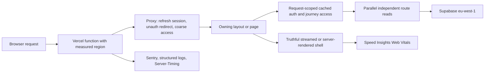

# Non-Payment Web-App Latency Improvement Plan

**Date:** 2026-08-13

**Status:** Phase 1 review-ready locally; production observation and Phases 2–3 remain gated

**Branch:** `codex/latency-best-practices-research`

**Implementation shape:** three guarded phases, each independently reviewable, measurable, deployable, and reversible

## Outcome

Make Chaarlie's authenticated app feel materially faster and calmer by:

1. measuring route, proxy, database-round-trip, rendering, and browser-vital latency with one privacy-safe vocabulary;
2. removing repeated request-path work while preserving fail-closed authorization;
3. delivering truthful loading and ready states from the server whenever the server already knows them.

This plan does **not** change payment-provider calls, checkout, webhook handling, purchase or refund state, entitlement semantics, fulfilment jobs, or billing reconciliation. `/plan-bereit` is in scope only as a rendering and request-efficiency surface; all payment and access outcomes remain authoritative and unchanged.

## Source context

- General benchmark: [`docs/research/web-app-latency-post-payment-best-practices-2026-08-13.md`](../docs/research/web-app-latency-post-payment-best-practices-2026-08-13.md)
- Chaarlie comparison: [`docs/research/chaarlie-latency-post-payment-comparison-2026-08-13.md`](../docs/research/chaarlie-latency-post-payment-comparison-2026-08-13.md)
- Approved planning evidence: [`plans/evidence/2026-08-13-plan-ready-quiz-transition-aligned.html`](evidence/2026-08-13-plan-ready-quiz-transition-aligned.html)
- Current source assessed at `main` SHA `ef0ecfb81271a00762d4984c9638d6db28c7d8f6`.
- Current live topology verified read-only during research: Vercel dynamic functions in `iad1`; Supabase project `pqdkhefxsxkyeqelqegq` in `eu-west-1`.

## Agreed decisions

| Decision | Chosen direction | Why | Explicitly rejected or deferred |
| --- | --- | --- | --- |
| Compute region | Deferred to a separate cross-cutting infrastructure decision | Current Vercel project-level region configuration would also move payment, webhook, and reconciliation functions. Next.js 16.2.4 marks route-level `preferredRegion` deprecated, so this plan cannot prove a supported non-payment-only move. | No `regions: ["dub1"]` change in this plan. A later plan may still choose EU-first placement with the required whole-project verification. |
| Delivery | Three guarded phases | Separates topology/measurement, request ownership, and visual state delivery so each effect is attributable and reversible. | One combined performance rewrite. |
| Telemetry | Extend Sentry + structured Vercel logs + `Server-Timing`; add Vercel Speed Insights | Uses the current stack and adds real-user browser vitals without introducing a new observability vendor. | New OpenTelemetry backend or user-identifying performance payloads. |
| Request ownership | Route-owned guards | Proxy retains session refresh, unauthenticated redirects, and coarse access enforcement. Profile, hair-profile, and Personal Plan frontier decisions move to owning server layouts/pages when fail-closed behavior can be preserved. | Removing the proxy or weakening authorization; keeping every route-specific database read in the proxy. |
| `/plan-bereit` initial state | Server-first and read-only | A complete, already-authoritative state should be actionable in the first render. Genuine linking/provisioning still uses the existing explicit idempotent mutation and bounded polling. | A hidden mutation in GET/page render; optimistic access; always showing `checking` after hydration. |
| Readiness UI | Quiz-transition-aligned, minimal | Uses the existing saved → checking/ready → one CTA language without ornamental preview art, Sparkles, fake percentages, or a forced minimum wait. | The first decorative mockup; artificial progress milestones. |

## Non-negotiable guardrails

- Authorization remains fail-closed. A URL, cookie, query parameter, client state, or cached response cannot grant access.
- Auth and access decisions are never cached across requests or users. React `cache()` is allowed only for request-scoped deduplication in a Server Component render.
- API handlers retain their own authorization checks even when the proxy has already run.
- `GET` and Server Component rendering remain read-only. Any source-link mutation remains an explicit idempotent `POST` or `PATCH`.
- Current Personal Plan stage order remains Bedarf → refinement → exact products → Routine → Anwendung.
- Existing forbidden, missing-fact, transient-error, timeout, retry, and support behavior remains available.
- No customer identifiers, email addresses, lead IDs, provider references, payment IDs, raw URLs with secrets, or free-form error bodies enter performance logs or Speed Insights metadata.
- Production environment changes, deployments, monitoring activation, and rollout remain separate authorization gates.
- `paid_pending_recovery` keeps its current “Zahlung bestätigt” and “Du musst nichts erneut kaufen” reassurance verbatim; the minimal quiz-transition restyle does not apply to that payment-specific surface.

## Current-state evidence

| Surface | Current finding | Planning implication |
| --- | --- | --- |
| Region | `vercel.json` has no region policy; current functions report `iad1`, database is `eu-west-1`. | Tag the current region in measurements. Record the mismatch as a separate future cross-cutting infrastructure decision; do not change region in this plan. |
| Proxy | `src/proxy.ts` matches almost every non-static request. For `/routine`, `/anwendung`, `/chat`, and `/tracker`, the authenticated branch performs profile, hair-profile, and frontier reads plus redirect/503 decisions before page execution. Other protected routes use narrower proxy branches. | Preserve coarse gates and exact redirect/503 behavior, but remove those four routes' page-specific reads from the global critical path. |
| Server reads | `/plan-start` serializes auth → journey access → Stage 1 preload → refinement. Other routes already use request-scoped cached navigation access and some independent reads use `Promise.all`. | Reuse the good loader pattern and parallelize only reads whose dependency graph proves independence. |
| Loading | `/routine` and `/anwendung` have `loading.tsx`; `/plan-start`, `/plan-bereit`, `/profile`, `/chat`, and `/tracker` do not. | Add form-faithful route shells instead of blank waiting or ornamental animation. |
| Readiness | `/plan-bereit` does server auth/access/enrollment work, renders `checking`, then the browser issues a POST after hydration to learn the first actionable state. | Resolve the initial read-only state on the server and poll only for genuine convergence. |
| Telemetry | Sentry, structured duration logs, and several `Server-Timing` headers exist, but route-region, cold/warm, proxy/page breakdowns, Web Vitals, and a coherent percentile view are missing. | Standardize the envelope before optimization so later claims are falsifiable. |
| Database | Aggregated SQL execution is much smaller than observed app request time on sampled paths. | Prioritize topology and round-trip count before broad SQL micro-optimization. |

## Target request model

The proxy remains a security boundary, but it stops acting as the universal owner of route-specific profile and journey-frontier decisions. The owning layout or page performs those decisions once, request-scoped, close to the database, and can share the result with its child render.

## Phase 1 — Establish a trustworthy latency baseline

### 1A. Add a privacy-safe performance envelope

**Consumes**

- Existing `src/lib/personal-plan/transition-performance.ts` timing pattern.
- Existing Sentry initialization and route-specific `Server-Timing` headers.
- Current `iad1` deployment as the baseline topology.

**Produces**

- One shared server timing helper with a bounded vocabulary:
  - `route_group`: `plan_start`, `plan_ready`, `routine`, `anwendung`, `profile`, `chat`, `tracker`;
  - `operation`: `proxy_auth`, `proxy_access`, `route_access`, `route_data`, `render_total`;
  - `outcome`: `success`, `redirect`, `denied`, `not_found`, `transient_error`;
  - `region`: `VERCEL_REGION` or `unknown`;
  - `duration_ms`, request-scoped query/round-trip count where measurable, and a privacy-safe generated request correlation ID.
- The correlation ID may appear only in a structured request log field and matching Sentry span context. It is never a Sentry tag, metric dimension, `Server-Timing` value, Speed Insights metadata, user/session key, or public response body/header.
- `Server-Timing` for the same operations where headers can be set safely.
- Sentry child-span attributes and structured logs derived from that bounded vocabulary, with current scrubbing preserved.
- `@vercel/speed-insights` and `<SpeedInsights />` in the root layout after verifying the current privacy/cookie policy.
- A documented baseline receipt for the seven route groups, split by region and cold/warm signal when available.

**Completion criteria**

- The envelope contains no raw path query, user/lead/payment/provider identifiers, email, or free-form exception text.
- Unit tests reject disallowed keys and high-cardinality values and cover every telemetry sink.
- Existing Sentry error capture and current `Server-Timing` tests continue to pass.
- Preview verification shows one event/spans set per request rather than duplicate page/proxy events.
- A separately authorized production observation window captures at least seven days or 100 non-internal samples per primary route group, whichever is later. p99 is labelled descriptive unless sample size is large enough to support it.

### 1B. Publish the baseline and preserve the region decision boundary

**Consumes**

- The 1A baseline and its exact route/segment definitions.
- Current Vercel/Next runtime behavior showing project-level region configuration is cross-cutting and route-level `preferredRegion` is deprecated in the installed framework.

**Produces**

- A baseline receipt with p50/p75/p95, sample counts, error rate, route outcomes, region from `VERCEL_REGION`, and cold/warm signal where available.
- A separate follow-up decision brief for a possible EU-first project-wide migration, explicitly naming payment/webhook/reconciliation blast radius and whole-project verification.
- No `vercel.json` region change, deprecated `preferredRegion` export, Fluid Compute, memory, instance-size, runtime, caching, or database-region change in this plan.

**Completion criteria**

- Baseline definitions and queries are reproducible from the receipt.
- Report p50/p75/p95 and sample counts for server duration and TTFB; report Web Vitals only after enough traffic.
- The receipt explicitly states that the region mismatch remains uncorrected and no before/after region improvement is claimed.

**Rollback**

- Revert the instrumentation/Speed Insights PR if it causes privacy, performance, or stability regressions. There is no topology change to roll back.

## Phase 2 — Remove duplicated request-path work

### 2A. Define and test route ownership before moving guards

**Consumes**

- Current proxy route classes and redirect precedence.
- Existing `loadAuthenticatedAppNavigationAccess`, `loadCachedAuthenticatedAppUserId`, and `loadCachedPersonalPlanJourneyAccessForUser` request-scoped loaders.
- Current protected-route, middleware, Personal Plan frontier, admin, and API authorization tests.

**Produces**

- A route matrix that names, for every affected route:
  - proxy-owned session/coarse-access decision;
  - layout/page-owned profile, hair-profile, and frontier decision;
  - canonical redirect and precedence;
  - handler-owned API authorization;
  - failure behavior when Supabase is unavailable, including the current `503`, German copy, and `no-store` response where frontier loading fails rather than redirects.
- Concrete boundaries: `/profile`, `/routine`, `/anwendung`, and `/chat` keep route-local layouts, but receive a separate authoritative route-access resolver before proxy reads move; the existing cached navigation loader remains presentation-only because it catches failures and cannot replace a fail-closed guard. `/plan-start` keeps a page-local resolver; `/tracker` gains a route-local server boundary before its route-specific proxy reads can move. Do not create a broad root authenticated layout in this phase.
- Characterization tests for unauthenticated, no-access, incomplete-profile, missing-hair-profile, each Personal Plan frontier stage, admin, malformed path, and transient database failure.

**Completion criteria**

- The current behavior is executable as a regression oracle before moving logic.
- Any route whose fail-closed behavior or redirect precedence cannot be proved stays in the proxy.

### 2B. Move route-specific reads to owning server boundaries

**Consumes**

- The approved route matrix and characterization tests.

**Produces**

- Proxy keeps session refresh, unauthenticated redirect, coarse paid/free access gate, admin protection, and public-route bypasses.
- Profile, hair-profile, and Personal Plan frontier reads move from the broad proxy branch into the relevant authenticated layouts/pages.
- Authoritative route access remains fail-closed and preserves the current redirect/503 precedence. After it succeeds, shared layouts may reuse the current React `cache()`-backed navigation/access loaders for request-scoped presentation deduplication.
- API routes retain explicit in-handler authorization and do not rely solely on the proxy.
- `/plan-start` reuses cached auth/journey access and removes provable duplicate reads. Stage 1/refinement parallelization is deferred: the current Stage 2 gate makes a speculative refinement read wasteful for Stage-1-only users, and resolving that gate first removes the claimed concurrency win.
- Per-request round-trip counters and timing spans show the exact before/after work, rather than inferring improvement from code shape.

**Completion criteria**

- Every route-matrix test passes with identical redirect/access outcomes.
- No authorization value is cached across requests.
- Direct API calls remain denied when unauthenticated or unauthorized.
- A regression test proves that denied, Stage-1-only, or unavailable access never starts a Stage 2 refinement read.
- Controlled preview replay shows fewer authenticated Supabase round trips for the proxy-heavy `/routine`, `/anwendung`, `/chat`, and `/tracker` routes.
- `/plan-start` and `/profile` are evaluated by critical-path duration and safe concurrency/deduplication, not by an unsupported claim that their retained coarse proxy gate disappears.
- Compare route p50/p75/p95 and error rate against Phase 1's measured baseline. Any route with worse p95 or changed security behavior blocks rollout.

**Rollback**

- Revert the route-ownership PR as one unit. Phase 1 telemetry remains independent.

## Phase 3 — Deliver useful state earlier and simplify waiting

### 3A. Add route-level loading boundaries

**Consumes**

- Existing `/routine` and `/anwendung` loading-shell conventions.
- The approved quiz-transition-aligned planning evidence.

**Produces**

- Route-level `loading.tsx` for `/plan-start`, `/plan-bereit`, `/profile`, `/chat`, and `/tracker` where server work currently blocks all route feedback.
- Shells preserve the owning route's header, width, typography, and major geometry to reduce layout shift.
- No synthetic percentage, proxy progress bar, fake milestone, forced delay, product preview art, Sparkles, or looping decorative motion.

**Completion criteria**

- Mobile and desktop screenshots show stable geometry from loading to settled state.
- `prefers-reduced-motion` and screen-reader announcements remain correct.
- CLS does not regress and loading shells do not expose protected data.

### 3B. Make `/plan-bereit`'s first state server-owned and read-only

**Consumes**

- Current readiness resolver and status route.
- Approved evidence at `plans/evidence/2026-08-13-plan-ready-quiz-transition-aligned.html`.

**Produces**

- A shared read-only resolver returns the initial readiness envelope: status, canonical lead ownership result, source version when safe, missing facts, and whether an explicit mutation is still required.
- The page passes that envelope into the client instead of always passing `checking`.
- `ready` is rendered on the server only when ownership, source, current access rules, and the concrete no-op predicates below are all true.
- The read-only resolver distinguishes legacy and Personal Plan sources and returns an explicit `link_required` pending state if any predicate fails:
  - **Legacy:** `leads.user_id` equals the authenticated user; quiz answers classify as complete; and every persisted `hair_profiles` field produced by `buildProfileDataFromQuizAnswers` (excluding `goals`, as the current upsert does) equals the projected value with null-safe equality. `leads.status` is not part of the no-op predicate because the current linker does not repair it when `user_id` already matches; this plan preserves that behavior rather than silently adding an integrity mutation.
  - **Personal Plan:** exactly one `status = 'attached'` artifact for the lead has `user_id` equal to the authenticated user; its canonical profile is valid; and every persisted `hair_profiles` field produced by `buildProfileDataFromPersonalPlanCanonicalProfile` (excluding `goals`) equals the projected value with null-safe equality.
- Projection equality covers the fields owned by the current builders: `hair_texture`, `thickness`, `hair_length`, `density`, `cuticle_condition`, `protein_moisture_balance`, `scalp_type`, `scalp_condition`, `concerns`, and `chemical_treatment`, limited to keys present in the desired projection.
- Mere artifact status `attached` or `hasCompletedQuizDiagnostics(profile)` is insufficient because neither proves the current RPC binding and profile upsert are already semantic no-ops.
- The resolver runs server-side with the existing service-role client; browser/authenticated clients cannot read canonical artifact data. Its result is advisory, and the existing linker/RPC remains the authority if state changes concurrently.
- Terminal states do not issue a hydration POST.
- Only genuine `checking`/`source_pending` or mutation-required states start the existing explicit idempotent POST and bounded GET polling loop.
- GET remains read-only; PATCH remains the missing-fact mutation; current access/payment outcomes and support paths are unchanged.
- UI follows the approved minimal pattern:
  - “Deine Angaben sind gespeichert”;
  - one truthful `checking` or `ready` headline;
  - one factual static status row without percentages or a proxy progress bar;
  - one `Bedarfsplan ansehen` CTA when ready;
  - retry/support only at their current semantic thresholds.
- `paid_pending_recovery` is not restyled and preserves its current payment reassurance copy and actions.
- This deliberately swaps a browser hydration/API hop for a server-side read on eligible ready requests; measurement must prove the first-actionable-state improvement rather than describing it as a removed database read.

**Completion criteria**

- Server-ready test: first HTML contains the actionable ready state and the browser sends no status POST.
- Separate legacy-source and Personal-Plan-source tests prove that no-POST is allowed only when all previously mutating linkage effects already exist.
- Projection-equality tests cover missing, stale, extra, and null profile values; an artifact attached with a null/different `user_id`; and a complete-looking but non-equal hair profile. Each must remain `link_required` and execute one POST.
- Race test: a binding conflict after the read-only decision remains fail-closed through the authoritative RPC; the page never converts the advisory result into access by itself.
- Pending test: first HTML is honestly pending, exactly one initial idempotent POST occurs, then bounded GET polling continues until terminal state or timeout.
- GET read-only contract test detects any attempted write.
- Reload, browser Back, two-tab, missing-fact, forbidden, timeout, transient-error, and no-JavaScript first-render cases preserve correct behavior.
- Existing Personal Plan transition and recovery suites remain green.
- Mobile and desktop browser verification matches the approved hierarchy and preserves the five-stage header semantics.

**Rollback**

- Revert the server-first readiness/UI PR. Existing status endpoint and recovery semantics remain backward-compatible during the phase.

## Local Phase 1 implementation receipt

**Implemented on 2026-08-13; not deployed or activated in Vercel.**

- Added a bounded `app_performance` event helper and instrumented the existing aggregate proxy access chain for the seven priority route groups. The measurement is named `proxy_access` because it currently includes authentication plus coarse and route-specific access work; it does not claim a separate auth-only duration.
- Events use generated UUID v4 correlation IDs, validated route/operation/outcome/region fields, JSON structured logs, existing-transaction-only Sentry child spans, and correlation-free `Server-Timing` headers.
- Added one ungated Vercel Speed Insights component in the root layout, following Nick's explicit pre-consent decision. Its `beforeSend` boundary keeps only the seven measured app route groups, replaces paths and queries with fixed canonical labels, and drops all other routes so lead, auth, provider, and payment-return identifiers cannot enter Speed Insights. The German privacy notice discloses those anonymous, bounded fields and the chosen legal basis. Dashboard enablement and production collection remain separate gates.
- Local browser proof on `/datenschutz` covered desktop and mobile rendering, one Speed Insights script before a cookie choice, the unchanged cookie controls, and no browser errors. A local unauthenticated `/routine` request produced one `app_performance` JSON event and one `app_proxy_access` `Server-Timing` value.
- Phase 2 exploration found that the current cached navigation loader is deliberately presentation-fail-open, so it cannot replace proxy security checks. Phase 2 must first add a route-owned authoritative resolver and characterize `/tracker`'s current frontier fall-through behavior.
- Phase 3 exploration found that existing Routine/Anwendung loading shells use looping `animate-pulse`; new shells must instead follow the approved static/no-looping-motion contract.
- Production sample collection, percentile publication, route-level round-trip counts, cold/warm classification, topology changes, and any Phase 2 or Phase 3 code remain unimplemented pending the Phase 1 observation gate.

## Designed user journey

### Entry

An authenticated user opens an app route. The request reaches the currently configured Vercel function region, the proxy refreshes the session and enforces coarse access, and the owning layout/page resolves only the route-specific data it needs. Static assets continue to come from the global CDN, and telemetry records the actual execution region for later comparison.

### Normal route transition

1. The destination's form-faithful loading shell appears if server work exceeds the navigation boundary.
2. The owning server boundary resolves request-scoped auth/access once and starts independent data reads together.
3. The settled page replaces the shell without a large geometry shift.
4. Sentry/log spans and `Server-Timing` identify region, route group, operation, outcome, and duration without user identity.

### `/plan-bereit`: already complete

1. The server verifies the same ownership, access, source, profile, and completed-linkage evidence as today.
2. The first HTML says “Dein Haarplan ist bereit” and shows `Bedarfsplan ansehen`.
3. Hydration does not send a redundant status POST.
4. The CTA opens `/plan-start`, whose server preload and loading boundary make the first Bedarf step available without avoidable serial reads.

### `/plan-bereit`: genuine convergence still required

1. The first HTML says “Wir bereiten deinen Haarplan vor” and explains that the saved analysis is being connected.
2. If a write is genuinely required—including an incomplete legacy/artifact/profile link—the client performs the existing explicit idempotent POST once.
3. The client uses bounded read-only GET polling for subsequent checks.
4. Ready replaces pending and exposes the CTA; timeout/transient error exposes retry; forbidden/invalid source exposes support; missing facts retain the existing explicit form.
5. The interface never claims a percentage it cannot derive and never treats a browser state as authority.

### `/plan-bereit`: recovery and boundary states

- **Transient error:** the first trustworthy state says the check could not complete; retry is available and no ready CTA appears.
- **Timeout/source pending:** the page keeps the saved-data reassurance, says activation is taking longer, and exposes the existing retry path. Payment-specific reassurance appears only on the unchanged `paid_pending_recovery` surface.
- **Forbidden/invalid source:** no plan data or CTA is exposed; the existing support path remains.
- **Missing fact:** the explicit question/form remains the only way to supply the missing value; it is never guessed from stale or unrelated data.
- **Reload:** the server recomputes the authoritative read-only envelope. A complete state returns ready immediately; an incomplete linkage returns `link_required` and the idempotent POST remains safe.
- **Browser Back:** returning to the page repeats the same authoritative decision rather than trusting client history state.
- **Two tabs:** both tabs may read status; uniqueness/idempotency prevents duplicate linkage effects, and each converges to the same terminal state.
- **No JavaScript:** a server-ready page still shows the CTA. A pending or mutation-required page shows an honest static state plus a normal refresh link and support link; it does not imply that automatic polling is running.

## Verification strategy

### Static and unit checks

- `npm run ci:verify` plus the focused Node, Personal Plan, middleware, and browser tests named by each phase; the repository `ready-check` and `request-code-review` skills own the final verification/review receipts rather than being treated as npm commands.
- Performance-envelope schema, PII/high-cardinality rejection, region parsing, and `Server-Timing` tests.
- Proxy/route authorization and redirect-precedence characterization tests.
- Request-scoped loader deduplication and independent-read concurrency tests.
- Readiness server-first/no-POST, pending bounded-poll, and GET-read-only tests.

### Browser checks

- Desktop and mobile for `/plan-start`, `/plan-bereit`, `/routine`, `/anwendung`, `/profile`, `/chat`, and `/tracker`.
- Unauthenticated, no-access, incomplete-profile, each Personal Plan frontier stage, ready, pending, error, timeout, reload, Back, and two-tab scenarios.
- Reduced motion, keyboard focus, live-region behavior, and layout shift.
- Inspect request logs to prove terminal server-ready pages skip the client status POST.

### Performance checks

- Report sample count and p50/p75/p95 for server duration and TTFB by route group, region, and cold/warm signal where available.
- Report LCP, INP, and CLS from Speed Insights by route group and device class after sufficient traffic.
- Compare authenticated Supabase round-trip counts before and after Phase 2.
- Treat p99 as descriptive until traffic supports it; never claim a statistically meaningful improvement from a handful of requests.
- Security or error-rate regression blocks rollout even if latency improves.

## Artifact disposition

- **Keep:** both research reports, this plan, and the approved HTML planning evidence.
- **Discarded:** the initial decorative Plan Bereit mockup was rejected and removed before final planning.
- **Generated screenshots:** local review artifacts are ignored by the repository; retain only as task-local evidence unless publication is explicitly requested.
- **Counterpart review output:** transient `/tmp` evidence unless a finding is intentionally summarized in the ledger below.

## Counterpart review ledger

| Finding | Disposition | Plan change or rationale |
| --- | --- | --- |
| Project-level `regions` would violate the chosen non-payment scope. | Accepted | Nick chose to defer region migration. Phase 1 now measures and publishes the mismatch but performs no topology change or deprecated route-level workaround. |
| Server-ready must prove all effects of the current linking POST are already materialized. | Accepted | Added concrete legacy and Personal Plan no-op predicates: lead ownership, artifact user binding, and exact equality of every profile field the current upsert projects. Mere attached/completed status is explicitly insufficient. |
| Pending evidence still looked like quantitative progress. | Accepted | Removed the filled track from the approved evidence and prohibited proxy progress bars. |
| Error, reload, Back, two-tab, and no-JS paths were tested but not designed. | Accepted | Expanded the designed journey and defined a static refresh/support no-JS fallback. |
| Correlation ID could leak into high-cardinality sinks. | Accepted | Restricted it to structured request logs and Sentry span context; forbidden in tags, metrics, timing headers, Speed Insights, and public data. |
| Route ownership was too abstract. | Accepted | Named route-local boundaries, prohibited a new broad authenticated root layout, and added a dedicated `/tracker` boundary. |
| Round-trip reduction overreached for `/plan-start` and `/profile`; `/tracker` was omitted. | Accepted | Reduction criterion now targets the proxy-heavy routes; `/plan-start` and `/profile` use critical-path criteria; `/tracker` is measured and tested. |
| Verification skill names were mistaken for nonexistent shell commands. | Rejected as a reviewer discovery error; wording clarified | The repo contains `.agents/skills/ready-check`, `request-code-review`, and `implementation-loop`. Added the actual shell gate `npm run ci:verify` and clarified that the skill names own workflow receipts. |
| Consider deferring Speed Insights. | Rejected by prior owner decision | Nick selected the existing-stack telemetry option including Speed Insights. Privacy/cookie review remains a completion gate. |
| Route matrix could lose the current fail-closed `503` by modeling every frontier result as a redirect. | Accepted | The matrix must preserve redirect precedence plus the exact unavailable `503`, German copy, and `no-store` behavior. |
| `/plan-start` parallelization could speculatively query Stage 2 for Stage-1-only users. | Accepted | Parallelization is deferred; Phase 2 only removes proven duplicates and tests that Stage 2 is never read without its gate. |
| Full telemetry envelope versus a lean targeted subset. | Retained by prior owner decision | Nick chose the existing-stack telemetry path including Speed Insights. Bounded fields, sample-size rules, and privacy/cookie activation gates constrain it. |
| Counterpart re-review of reconciled plan | Completed with revisions | Second high-effort review approved the overall phase shape and identified the concrete linkage, 503, and Stage 2 issues incorporated above. Raw output remains transient outside the repository. |
| Current readiness proves eligibility but not that profile/link writes are no-ops. | Accepted | Focused Supabase/source audit enumerated the exact legacy and Personal Plan predicates, projection-owned fields, service-role boundary, and race contract now specified in Phase 3B. |

## Approval and handoff gates

- [x] General research completed before product comparison.
- [x] Chaarlie comparison completed read-only with workers/explorers.
- [x] Delivery, telemetry, request-ownership, server-first behavior, and the deferral of the cross-cutting region migration aligned with Nick.
- [x] Revised user-facing evidence reviewed and approved by Nick.
- [x] Counterpart plan review completed and findings reconciled.
- [x] Final designed user journey explicitly signed off by Nick.
- [x] Implementation authorized in the existing task worktree on 2026-08-13; execution begins with Phase 1 and stops before production activation.
- [x] Phase 1 ready-check and findings-first code review completed; the supported privacy finding was fixed and the exact delta re-reviewed with no blocking findings.
- [ ] Production activation separately authorized after review-ready verification.

Remaining implementation continues through `implementation-loop`. Each phase must pass `ready-check` and `request-code-review`; commit/push/draft PR require a later explicit “ship it”, and deployment/production activation remain separate.
