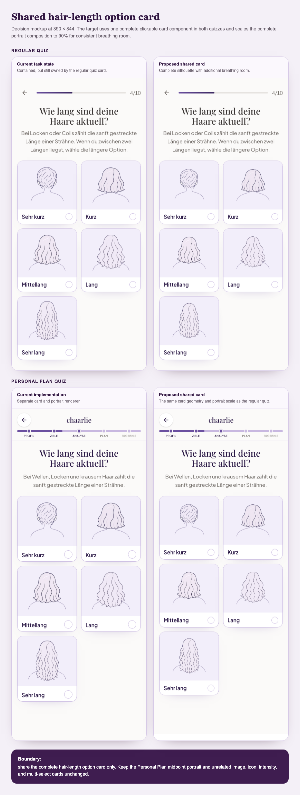

# Shared hair-length card containment

## Outcome and source context

The regular quiz and Personal Plan quiz use one shared hair-length option-card component. Every length portrait is fully visible with consistent breathing room at supported mobile and desktop sizes. This replaces the initial regular-quiz-only scope after the runtime trace confirmed that both quiz questions expose the same user need through separate implementations.

## Chosen direction

Create a dedicated shared `HairLengthOptionCard` for the complete clickable card used by both hair-length questions. It owns the canonical portrait composition, media/footer geometry, responsive sizing, accessible pressed state, and 90% portrait scale. A narrow `selectionVariant` preserves each flow's existing selected-state language: the regular quiz keeps its 20 px selector/ring treatment, while Personal Plan keeps its 24 px selector and plum-ice selected surface. Both quizzes retain their own question shells, progress, copy, state, tracking, and navigation.

Also extract the duplicated lightweight portrait figure so the shared card and the existing Personal Plan midpoint use the same simple asset/body renderer. The midpoint keeps its current size; the additional breathing-room scale belongs only to `HairLengthOptionCard`. The richer analysis artwork in `hair-portrait.tsx`, with marker and failure behavior, remains a separate component.

Do not replace every Personal Plan `OptionCard` with the regular `QuizOptionCard`. Those broader components have materially different responsibilities: Personal Plan intensity pips, Lucide icon mapping, image preloading, multi-select behavior, and non-length layouts versus the regular quiz's onboarding/refinement callers and trailing controls. Sharing the hair-length specialization fixes the divergence without coupling unrelated cards.

## Scope and non-goals

In scope:

- Use the same complete hair-length option card in the regular quiz and Personal Plan quiz.
- Apply identical responsive media/footer geometry, portrait scale, and accessible pressed-state behavior in both flows.
- Preserve each flow's existing selected-state styling through one narrow shared-card variant so the length question remains consistent with neighboring questions.
- Center the complete portrait composition at 90% scale by transforming the composed figure wrapper, including both the image and shared neck/shoulder outline.
- Reuse one portrait-figure renderer for the shared card and the unchanged Personal Plan midpoint portrait.
- Add direct shared-component and focused flow tests without brittle source-count guards.

Non-goals:

- No portrait regeneration or changes under `public/images/quiz/hair-portrait/`.
- No change to the Personal Plan midpoint layout or scale.
- No redesign of generic image, icon, intensity, multi-select, onboarding, refinement, result, or offer cards.
- No changes to question copy, answer values, auto-advance timing, draft/resume behavior, tracking, recommendation logic, routes, or funnel eligibility.

## Target map

- `src/components/quiz/hair-portrait-figure.tsx` (new): shared canonical asset plus neck/shoulder renderer.
- `src/components/quiz/hair-length-option-card.tsx` (new): shared clickable hair-length card and responsive visual contract.
- `src/components/quiz/quiz-option-card.tsx`: delegate portrait-grid rendering to the shared hair-length card while preserving the regular quiz animation wrapper and all non-portrait branches.
- `src/components/personal-plan-quiz/personal-plan-quiz.tsx`: delegate portrait options to the shared hair-length card, remove the duplicate portrait renderer, and keep the midpoint on the shared figure at its existing size.
- `tests/hair-length-option-card.test.tsx` (new) and focused existing quiz tests: shared geometry, accessible state, portrait composition, caller adoption, and midpoint boundary.
- `plans/assets/hair-length-card-fit/shared-hair-length-card-mockup.png`: responsive decision evidence.

## Designed user journey

1. A user reaches “Wie lang sind deine Haare aktuell?” in either the regular quiz or the Personal Plan quiz after choosing a hair texture.
2. Both flows present the same five two-column hair-length cards with the surrounding flow's existing header, progress, helper text, and navigation unchanged.
3. Every card centers the complete texture-and-length silhouette, including hair ends and the neck/shoulder outline. The composition uses 90% of the available portrait frame, so very long hair retains visible breathing room instead of touching or crossing the label boundary. On short phones the artwork becomes smaller rather than being cropped.
4. The user selects one length. The regular quiz retains its familiar selector/ring treatment and Personal Plan retains its familiar larger selector and plum-ice selected surface. Both are rendered by the shared card, expose the same `aria-pressed` behavior, and retain their existing answer persistence and delayed automatic advance.
5. Back, refresh, and draft/resume behavior continue to restore the same question and answer because no quiz state contract changes.
6. Later in the Personal Plan flow, “Dein Profil nimmt Form an” continues to show the existing midpoint portrait at its current, correctly contained size. It reuses the low-level renderer but not the option-card scale or chrome.

There are no new loading, empty, error, or recovery states. If a portrait asset cannot load, existing route/page behavior remains unchanged; asset-fallback redesign is outside this card-containment task.

User-journey sign-off: **confirmed** on 2026-08-31. Nick approved the recommended shared-card journey and explicitly requested implementation with workers and explorers.

## Planning evidence

Question answered: can both quiz questions use one complete card component while preserving their different surrounding flow shells and leaving the correctly sized midpoint portrait unchanged?

Finding: yes. At 390×844 both question layouts accommodate the same 184 px card, 140 px media area, compact label footer, and 90% centered portrait composition. The shared target adds breathing room to all five lengths and makes the unselected question-card geometries identical. A narrow selection variant preserves local selected-state continuity; the midpoint remains outside the shared option card.

Selected direction: one shared complete hair-length option card, not a whole-system merge of every generic quiz card.

Evidence-review status: **confirmed** on 2026-08-31. Nick reviewed the revised shared-card artifact and proceeded with the recommended flow-local selection variants.

## Ordered tasks

1. Add a shared lightweight portrait-figure component that accepts the canonical `PortraitConfig`, decorative image behavior, sizing classes, padding, and image priority without owning card-specific scale. Personal Plan continues to build its config through `personalPlanPortraitConfig`. Completion: focused rendering tests prove own-body and shared-body assets still compose correctly; the Personal Plan midpoint renders through it with its existing `aspect-square w-full` and padding behavior unchanged. The richer analysis artwork remains untouched.
2. Add a bare-button `HairLengthOptionCard` around the shared figure. It owns one responsive contract: 184/152 px normal/short-mobile card height, 140/112 px media height, the existing desktop description behavior, a 90% transform on the composed wrapper, `aria-pressed`, and a narrow regular/Personal Plan selection variant. Completion: a server-rendered component test verifies geometry, whole-composition scaling, label/description association, both selected-state variants, and no clipping/cover classes.
3. Route the regular quiz portrait-grid branch through `HairLengthOptionCard`, retaining its existing per-card entry animation outside the shared bare button. Remove the private `HairPortraitVisual`. Fold the existing regular-only worktree change into this task and replace its markup-specific test with the shared-card contract. Completion: regular image/thumbnail/row branches remain unchanged and the rewritten focused test proves step 15 delegates to the shared behavior.
4. Route Personal Plan `option.portrait` through `HairLengthOptionCard`, remove its private portrait-card markup, and move the midpoint to the shared lightweight figure without the option-card scale. Completion: `tests/personal-plan-option-card-layout.test.ts` is updated only where the extracted portrait branch changes its structural assumptions; other Personal Plan option branches retain their current markup/behavior, and midpoint containment classes remain unchanged.
5. Verify both flows at 320×568, 375×667, 390×844, and 1280×900 with straight, wavy, curly, and coily portraits, emphasizing `long` and `very_long`. Completion: all five silhouettes and labels are complete, both questions have matching card geometry and selection presentation, midpoint appearance is unchanged, automatic advance and Back still work, and there is no horizontal overflow.

## Verification

Automated:

- New focused shared-card and shared-figure component tests.
- `npm run test:node`, including `tests/quiz-option-card.test.tsx`, portrait asset/component tests, and `tests/personal-plan-option-card-layout.test.ts`.
- `npm run test:personal-plan` through the repository's server-only shim; never run the nested Personal Plan suites through bare `tsx --test`.
- `npm run ci:verify` as the complete repository verification gate.
- Repository `ready-check` requirements for the final tree.

Manual/browser:

- Regular `/quiz` hair-length step at 320×568, 375×667, 390×844, and 1280×900.
- Personal Plan `/lp/haarplan` hair-length step at the same viewports.
- Straight, wavy, curly, and coily coverage, with explicit `long` and `very_long` endpoint checks.
- Selected/unselected states, automatic advance, browser Back, labels, focus ring, and horizontal/vertical containment.
- Personal Plan “Dein Profil nimmt Form an” midpoint as an unchanged visual control.

Migration/live-state checks: none; no schema, production data, auth, billing, rollout state, or external write is in scope.

Evidence-sensitive review: compare both final 390×844 question screens with the approved right-hand mockups, and compare the midpoint against its pre-change screenshot.

## Counterpart findings ledger

| ID  | Type                   | Evidence                                                                                                                                                                                                        | Decision                                                            | Plan change                                                                                                                                            | Revalidation                                  |
| --- | ---------------------- | --------------------------------------------------------------------------------------------------------------------------------------------------------------------------------------------------------------- | ------------------------------------------------------------------- | ------------------------------------------------------------------------------------------------------------------------------------------------------ | --------------------------------------------- |
| C1  | defect                 | Existing regular-only markup test would fail after removing `HairPortraitVisual`.                                                                                                                               | accepted                                                            | Fold the dirty diff into the shared refactor and rewrite the test in Task 3.                                                                           | `npm run test:node`                           |
| C2  | defect                 | Scaling only the image would desynchronise it from the shared SVG body.                                                                                                                                         | accepted                                                            | Pin the 90% transform to the composed figure wrapper in Task 2.                                                                                        | Component test plus browser geometry          |
| C3  | tradeoff               | Regular and Personal Plan selected-state treatments differ from neighboring cards.                                                                                                                              | accepted, pending user sign-off                                     | Use one shared card with a narrow selection variant instead of forcing one flow's selected chrome onto the other.                                      | Selected-state browser checks in both flows   |
| C4  | defect                 | Existing source-structure test and repository test shims were not named.                                                                                                                                        | accepted                                                            | Name `personal-plan-option-card-layout.test.ts`, `test:node`, `test:personal-plan`, and `ci:verify`.                                                   | Run exact commands                            |
| C5  | scope/product decision | Reviewer described the richer `HairPortrait` renderer as a live third caller. Repository search finds no runtime caller of `GuidedStoryAnalysis`; the richer renderer is nevertheless legitimate separate code. | rejected as a live-surface claim; accepted as a scope clarification | Drop the “one renderer” overclaim and leave richer marker/failure artwork untouched.                                                                   | `rg` caller trace and existing portrait tests |
| C6  | tradeoff               | Shared figure alt behavior differed between regular and Personal Plan.                                                                                                                                          | accepted                                                            | Treat the portrait image as decorative because the containing button already supplies the length label and description; avoid duplicate announcements. | Static markup accessibility assertion         |

## Review and handoff

- Branch: `codex/hair-length-card-fit` in `.worktrees/hair-length-card-fit`, based on fresh `origin/main` at task creation.
- Run one read-only Claude plan review, reconcile supported findings, then obtain Nick's explicit evidence and designed-journey sign-off before implementation.
- Execute with `implementation-loop`, which owns `ready-check` and `request-code-review` for the complete diff.
- Durable plan and shared-card mockup: **commit**.
- Superseded regular-only mockup: **discard before review-ready handoff** unless retained as useful before-state evidence.
- Transient local screenshots and capture script outside the repository: **discard after verification**.
- Stop at a verified review-ready worktree. Commit, push, PR, merge, deployment, and production changes require separate authorization.
