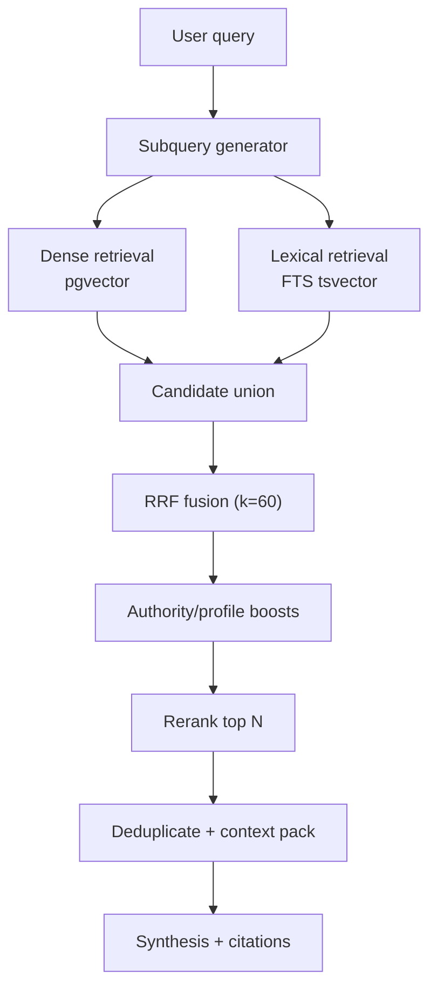

# Phase 1 PRD: Hybrid Retrieval + Reranking

## Document Metadata
- Version: 1.0
- Date: 2026-03-03
- Audience: Product + Engineering
- Phase window: W0-W3
- Release type: Big-bang

## 1) Context and Problem Statement
The current retrieval path in `src/lib/rag/retriever.ts` is embedding-first with source weighting and heuristic reranking. It works for many direct questions but has known gaps:
- Lower recall for keyword-sensitive questions (INCI names, exact product names, niche terms, spelling variants).
- Limited robustness on long or multi-clause prompts where one embedding may miss subtopics.
- Grounding confidence varies when semantically similar but weakly relevant chunks outrank exact matches.

This phase introduces a deterministic hybrid retrieval stack (vector + lexical + fusion + rerank) to improve evidence quality before generation.

Current production behavior includes a category-specific path for `shampoo` and `conditioner` requests. Phase 1 must treat that path as a non-regression baseline and extend retrieval quality without changing its business logic.

## 2) Goals, Non-Goals, and Success Criteria

### Goals
- Increase retrieval relevance and coverage for shared influencer corpus queries.
- Improve citation-groundedness by feeding better evidence into synthesis.
- Keep existing chat UX and SSE compatibility while enriching source metadata.

### Non-Goals
- No intent router redesign (Phase 2).
- No KG retrieval path (Phase 3).
- No production A/B framework work (Phase 4).
- No replacement of existing shampoo/conditioner concern mapping or category branching logic.

### Success Criteria
Primary quality targets:
- `nDCG@10 >= 0.72` on retrieval gold set.
- `Recall@20 >= 0.88` on retrieval gold set.
- Citation-grounded factual claim coverage `>= 95%`.
- Unsupported factual claim rate `<= 3%`.

Guardrail targets:
- Latency: `TBD-L1` (capture baseline during phase, lock target at phase exit).
- Cost per answer: `TBD-C1` (capture baseline during phase, lock target at phase exit).

## 3) In-Scope and Out-of-Scope

### In Scope
- Hybrid retrieval implementation for `content_chunks`.
- Query decomposition into retrieval subqueries.
- Fusion and rerank policy.
- Source payload enrichment (confidence/retrieval path fields).
- Backward-compatible SSE behavior.

### Out of Scope
- Clarification question policies.
- New knowledge graph tables or traversals.
- Cross-user/tenant corpus segmentation.

## 4) Functional Requirements

| ID | Requirement |
|---|---|
| FR-1 | System must run dense vector retrieval against `content_chunks.embedding`. |
| FR-2 | System must run lexical retrieval against `content_chunks` text via full-text search (`tsvector`). |
| FR-3 | System must support retrieval subqueries (2-4) generated from original user query. |
| FR-4 | System must fuse dense and lexical results using Reciprocal Rank Fusion (RRF), `k=60`. |
| FR-5 | System must preserve source-type authority weighting after fusion. |
| FR-6 | System must rerank top fused candidates with a dedicated rerank stage before final context packing. |
| FR-7 | Rerank stage must support configurable candidate ceiling (`rerankTopN`, default 12). |
| FR-8 | Final context set must be deduplicated and capped by token budget. |
| FR-9 | Retriever interface must expose retrieval debug metadata for observability. |
| FR-10 | SSE responses must continue sending existing events and include enriched `sources` payload where available. |
| FR-11 | On retrieval-stage failure, system must fail safe to current dense-only retriever path. |
| FR-12 | User-private memory retrieval remains strictly filtered by `user_id` (no change in isolation policy). |
| FR-13 | For `product_category = shampoo`, retriever metadata filtering must continue using thickness plus mapped scalp concern (`scalp_type`/`scalp_condition` mapping). |
| FR-14 | For `product_category = conditioner`, retriever metadata filtering must continue using thickness plus mapped protein/moisture concern (`protein_moisture_balance` mapping). |
| FR-15 | Product matching must preserve category pre-filter behavior for shampoo/conditioner and remain backward-compatible with existing DB category mapping (`Shampoo`/`Shampoo Profi`, `Conditioner`/`Conditioner Profi`). |
| FR-16 | Synthesis must preserve category-specific response guidance (shampoo and conditioner reasoning prompts) and not collapse to generic product phrasing. |

## 5) Non-Functional Requirements
- Reliability: Retrieval pipeline success rate `>= 99.5%` in steady state.
- Backward compatibility: Existing frontend handling for `content_delta`, `product_recommendations`, `sources`, `done`, `error` must not break.
- Maintainability: Retrieval constants (RRF `k`, candidate ceilings, thresholds) in config constants, not hardcoded across files.
- Security: Continue server-side admin client usage for protected operations; no client-side exposure of service-role retrieval internals.
- Auditability: Emit structured logs for retrieval path selection and stage timing (without logging raw PII text beyond current app policy).

## 6) Proposed Architecture and Mermaid Flow Diagram

### Architecture Overview
1. Query decomposition produces 2-4 subqueries.
2. Dense retrieval and lexical retrieval run per subquery.
3. Candidate sets are fused via RRF.
4. Source weighting and profile-aware boosts are applied.
5. Top fused candidates are reranked.
6. Dedup + context packing produces final chunk set for synthesis.



## 7) Data Model and Interface/API/Type Changes

### Database Changes
Create migration: `supabase/migrations/20260303_phase1_hybrid_retrieval.sql`

Required changes:
1. Add lexical search surface for `content_chunks`.
2. Add indexes for efficient hybrid retrieval.
3. Add/replace SQL functions for dense/lexical/hybrid retrieval.

Proposed SQL elements:
- `content_chunks.search_vector tsvector` generated from `content`.
- GIN index on `search_vector`.
- Function `match_content_chunks_dense(...)`.
- Function `match_content_chunks_lexical(query_text text, ...)`.
- Function `match_content_chunks_hybrid(query_text text, query_embedding vector(1536), ...)`.

### Type and Interface Changes
`src/lib/types.ts`
```ts
export interface ClassificationResult {
  intent: IntentType
  product_category: ProductCategory
  complexity?: "simple" | "multi_constraint" | "multi_hop"
  needs_clarification?: boolean
  retrieval_mode?: "faq" | "hybrid" | "hybrid_plus_graph" | "product_sql_plus_hybrid"
  normalized_filters?: Record<string, string | string[] | null>
  router_confidence?: number
}
```

`src/lib/rag/retriever.ts`
```ts
export interface RetrieveOptions {
  intent?: IntentType
  hairProfile?: HairProfile | null
  metadataFilter?: Record<string, string>
  count?: number
  subqueries?: string[]
  candidateCount?: number
  includeKeyword?: boolean
  rerankTopN?: number
  userId?: string
}
```

`RetrievedChunk` should include debug fields:
- `retrieval_path: "dense" | "lexical" | "hybrid"`
- `dense_score?: number`
- `lexical_score?: number`
- `fused_score?: number`

Category-specific invariants to preserve:
- Keep `mapScalpToConcernCode(...)` as shampoo concern source of truth.
- Keep `mapProteinMoistureToConcernCode(...)` as conditioner concern source of truth.
- Keep category-aware product prefilter contract in `matchProducts(...)`.

### SSE Payload Expectations
Maintain existing events, with additions:
- `sources`: include optional per-source `confidence` and `retrieval_path`.
- `done`: include optional retrieval summary (`candidate_count`, `final_context_count`).

Backward compatibility rule:
- New fields are additive and optional; existing client behavior remains valid.

## 8) Telemetry and KPI Instrumentation

### Event Schema
Emit server events:
- `retrieval_dense_completed`
- `retrieval_lexical_completed`
- `retrieval_fused`
- `retrieval_reranked`
- `retrieval_fallback_dense_only`

Each event includes:
- `conversation_id`
- `intent`
- `candidate_count`
- `stage_latency_ms`
- `top_source_types`

### KPIs Collected in Phase 1
- Retrieval relevance: `nDCG@10`, `MRR@10`, `Recall@20`.
- Grounding: citation coverage, unsupported claim rate.
- Operations: p50/p95 retrieval latency, synthesis latency, estimated cost per answer.

## 9) Risks, Dependencies, and Mitigations

| Risk | Impact | Mitigation |
|---|---|---|
| Lexical retrieval introduces noisy candidates | Medium | Use BM25 threshold + rerank stage hard cap |
| Fusion parameters misweight dense vs lexical | Medium | Offline sweep of RRF and source weights before release |
| Rerank stage latency spikes | Medium | Cap rerank candidates and model timeout fallback |
| Source payload format drift | Medium | Contract tests for SSE JSON shape |
| Retrieval fallback not exercised | High | Mandatory failure-injection test before release |

Dependencies:
- Stable embeddings service.
- Supabase migration window for new indexes/functions.
- Existing retrieval gold set and citation eval script.

## 10) Milestones and Phase Exit Criteria

### Milestones
| Milestone | Window | Deliverable |
|---|---|---|
| P1-M1 | W0-W1 | SQL migration merged and deployed to staging |
| P1-M2 | W1-W2 | Hybrid retriever code path integrated behind flag |
| P1-M3 | W2 | Rerank stage integrated with debug telemetry |
| P1-M4 | W2-W3 | Eval suite run and acceptance metrics reviewed |
| P1-M5 | W3 | Big-bang production release |

### Exit Criteria (must all pass)
1. `nDCG@10 >= 0.72` and `Recall@20 >= 0.88` on frozen eval set.
2. Citation-grounded claim coverage `>= 95%`.
3. Unsupported factual claim rate `<= 3%`.
4. Fallback path validated by controlled failure test.
5. No critical regression in existing e2e chat flows.

## 11) Test Plan and Acceptance Scenarios

### Automated Tests
- Unit:
  - Fusion score determinism tests.
  - Dedup logic tests on overlapping chunks.
  - Rerank ordering stability tests.
- Integration:
  - Dense-only, lexical-only, and hybrid path contract tests.
  - SSE payload schema tests for additive fields.
- E2E:
  - Existing chat journey with citation rendering intact.

### Required Acceptance Scenarios
1. Multi-constraint recommendation query returns intersecting evidence and citations.
2. Simple factual question remains fully cited with no KG branch.
3. Retrieval fallback works when lexical stage fails.
4. User memory retrieval remains isolated to requesting user.
5. Baseline-vs-phase retrieval regression report generated and reviewed.
6. Rollback scenario test confirms system can run dense-only path safely.
7. Shampoo request path still applies scalp concern mapping and category prefilter.
8. Conditioner request path still applies protein/moisture mapping and category prefilter.

## 12) Rollout, Rollback, and Post-Launch Checks

### Rollout Plan (Big-Bang)
1. Freeze branch and run full regression suite in staging.
2. Deploy migration + app code.
3. Enable hybrid retrieval flag in production globally.
4. Monitor first 24h with hourly KPI checks.

### Rollback Checklist
1. Disable hybrid retrieval flag and force dense-only retrieval.
2. Keep schema migration in place; rollback is logic-level, not destructive DB rollback.
3. Validate core chat path (`POST /api/chat`, streaming, citation events).
4. Publish incident summary with metric deltas.

### Post-Launch Checks (T+1 day, T+7 days)
- Verify KPI trends against phase targets.
- Review top failure clusters from retrieval logs.
- Lock Phase 1 constants before Phase 2 router integration.

## 13) Implementation Task List

### Decisions Locked In
- **Reranker**: Cohere `rerank-v3.5` cross-encoder API (external rerank call) ✅
- **Subquery decomposition**: GPT-4o-mini LLM call (2-4 subqueries per query) ✅
- **Eval gold set**: 20 template queries created, needs chunk ID annotation against live DB
- **Feature flag**: None — hybrid is the default path, dense-only as runtime error fallback only (try/catch) ✅

### Task Dependency Graph

```
Layer 1 — Foundations (parallel)
  #1  SQL migration
  #2  Extend TypeScript types
  #3  Subquery decomposition
        │
Layer 2 — Core retrieval (blocked by #1, #2, #3)
  #4  Hybrid retriever + RRF fusion
        │
Layer 3 — Rerank + telemetry (blocked by #4)
  #5  Cross-encoder reranker
  #7  Structured retrieval telemetry
        │
Layer 4 — Integration (blocked by #4, #5)
  #6  Wire into pipeline + enrich SSE
        │
Layer 5 — Validation (blocked by #6)
  #8  Eval gold set + eval script
  #9  Non-regression tests
```

### Tasks

#### #1 — ✅ SQL migration: tsvector column, GIN index, lexical/hybrid SQL functions
- Create `supabase/migrations/20260303_phase1_hybrid_retrieval.sql`
- Add `search_vector tsvector` column to `content_chunks`, generated from `content`
- Add GIN index on `search_vector`
- Backfill `search_vector` for existing rows
- Create `match_content_chunks_lexical(query_text, ...)` function (BM25-style FTS)
- Preserve existing `match_content_chunks` function (dense-only, used as error fallback)
- Keep all existing authority weighting tiers, metadata filtering, source_types filtering
- **Ref**: PRD Section 7, FR-1, FR-2, FR-4

#### #2 — ✅ Extend TypeScript types for hybrid retrieval
- Add to `ClassificationResult`: `complexity`, `needs_clarification`, `retrieval_mode`, `normalized_filters`, `router_confidence` (all optional, prep for Phase 2)
- Extend `RetrieveOptions`: `subqueries?: string[]`, `candidateCount?: number`, `includeKeyword?: boolean`, `rerankTopN?: number`, `userId?: string`
- Extend `RetrievedChunk`: `retrieval_path: "dense" | "lexical" | "hybrid"`, `dense_score?: number`, `lexical_score?: number`, `fused_score?: number`
- **Ref**: PRD Section 7

#### #3 — ✅ Implement GPT-4o-mini subquery decomposition
- New function: take user query, call GPT-4o-mini to decompose into 2-4 focused subqueries
- Handle German input
- For simple/short queries, return original query only (skip decomposition)
- On failure, fall back to original query as single subquery
- **Ref**: PRD FR-3, Section 6

#### #4 — ✅ Implement hybrid retriever with RRF fusion
- Rewrite `retrieveContext()` in `src/lib/rag/retriever.ts`
- Per subquery: run dense + lexical retrieval in parallel
- Apply Reciprocal Rank Fusion (RRF) with k=60
- Preserve source-type authority weighting after fusion (FR-5)
- Deduplicate candidates (existing 80% overlap logic)
- On failure in lexical/hybrid path, catch and fall back to dense-only (FR-11)
- Preserve category-specific metadata filtering for shampoo/conditioner (FR-13, FR-14, FR-15)
- Keep existing intent-based source routing (`INTENT_SOURCE_ROUTES`)
- **Ref**: PRD FR-1 through FR-5, FR-8, FR-11 through FR-16
- **Blocked by**: #1, #2, #3

#### #5 — ✅ Integrate Cohere cross-encoder reranker
- Install SDK, add API key to env
- Send top fused candidates (configurable `rerankTopN`, default 12) to reranker
- Re-sort by reranker score
- On reranker failure, fall back to RRF-fused order
- Add stage timing for telemetry
- **Ref**: PRD FR-6, FR-7
- **Blocked by**: #4

#### #6 — ✅ Wire into pipeline and enrich SSE payloads
- Pipeline: call subquery decomposition, pass subqueries to `retrieveContext()`
- Pipeline: pass `userId` for user-private memory isolation (FR-12)
- SSE `sources` event: add optional `confidence` and `retrieval_path` per source
- SSE `done` event: add optional `candidate_count`, `final_context_count`
- Backward compatible — new fields are additive/optional (FR-10)
- Preserve shampoo/conditioner synthesis instructions (FR-16)
- **Ref**: PRD FR-9, FR-10, FR-12, Section 7
- **Blocked by**: #4, #5

#### #7 — ✅ Add structured retrieval telemetry logging
- Emit: `retrieval_dense_completed`, `retrieval_lexical_completed`, `retrieval_fused`, `retrieval_reranked`, `retrieval_fallback_dense_only`
- Each event: `conversation_id`, `intent`, `candidate_count`, `stage_latency_ms`, `top_source_types`
- Structured console logs (JSON), no raw PII
- Extract retrieval constants (RRF k, candidate ceilings, thresholds) into config constants file
- **Ref**: PRD Section 8, NFRs
- **Blocked by**: #4

#### #8 — ✅ Build retrieval eval gold set and eval script
- Build gold set: 30-50 queries with known-relevant chunk IDs
- Eval script computes: `nDCG@10` (>= 0.72), `Recall@20` (>= 0.88), `MRR@10`
- Citation grounding eval: coverage (>= 95%), unsupported claim rate (<= 3%)
- Output comparison report: baseline (dense-only) vs hybrid
- **Ref**: PRD Section 2, 10, 11
- **Blocked by**: #6

#### #9 — ✅ Non-regression tests for shampoo/conditioner paths
- Shampoo: scalp concern mapping + category prefilter still applied
- Conditioner: protein/moisture mapping + category prefilter still applied
- Product matching: category pre-filter preserved (`Shampoo`/`Shampoo Profi`, `Conditioner`/`Conditioner Profi`)
- Synthesis: category-specific response guidance preserved
- User memory isolation: `user_id` filtering intact
- Dense-only fallback: works when lexical stage fails (controlled failure)
- SSE payload shape: existing events work, new fields optional
- **Ref**: PRD Section 11, rollout-index Section 3.1
- **Blocked by**: #6
