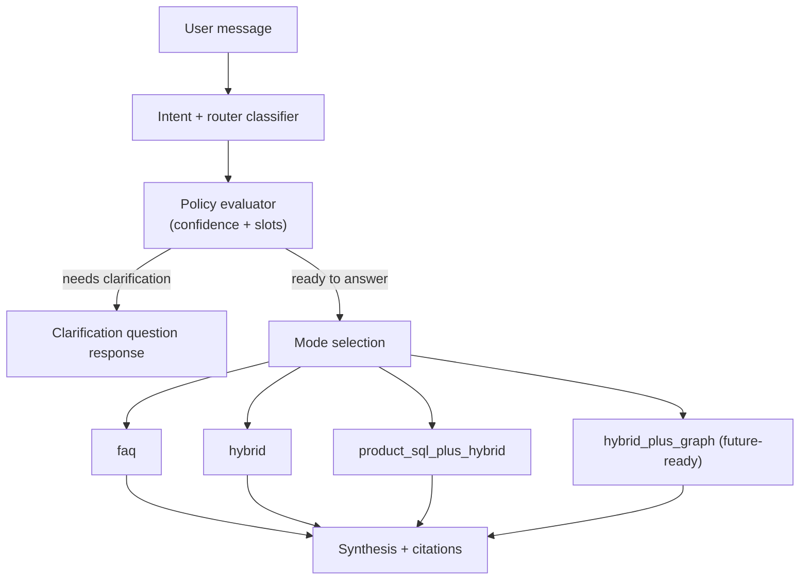

# Phase 2 PRD: Intent Router + Clarification Policy

## Document Metadata
- Version: 1.0
- Date: 2026-03-03
- Audience: Product + Engineering
- Phase window: W4-W6
- Release type: Big-bang

## 1) Context and Problem Statement
After Phase 1, retrieval quality improves, but decisioning on how to handle ambiguous or compound user messages remains underspecified. Today, intent output is limited and not sufficient to drive robust routing policies for:
- choosing the correct retrieval strategy,
- deciding when to ask clarifying questions,
- avoiding low-confidence guesses.

Phase 2 introduces an enriched router contract and deterministic clarification policy.

## 2) Goals, Non-Goals, and Success Criteria

### Goals
- Introduce explicit routing modes and confidence-aware behavior.
- Reduce wrong direct answers caused by missing constraints.
- Keep user experience conversational while preventing over-questioning.

### Non-Goals
- No KG implementation details beyond router compatibility hooks.
- No full experimentation platform (Phase 4).
- No tenant-level ACL model change.
- No removal of existing shampoo/conditioner specialized execution path.

### Success Criteria
Primary targets:
- Router mode accuracy `>= 90%` on labeled routing set.
- Clarification precision `>= 85%`.
- Unnecessary clarification rate `<= 10%`.
- Clarification recall for under-specified queries `>= 80%`.

Grounding continuity targets:
- Citation-grounded factual claim coverage remains `>= 95%`.
- Unsupported factual claim rate does not exceed Phase 1 by more than `+0.5pp`.

Guardrails:
- Latency: `TBD-L1`.
- Cost per answer: `TBD-C1`.

## 3) In-Scope and Out-of-Scope

### In Scope
- Router output schema expansion.
- Routing policy engine (mode selection + fallback defaults).
- Clarification trigger rules and max clarification rounds.
- SSE metadata updates for confidence/debug.

### Out of Scope
- KG graph traversal logic.
- Large prompt/voice redesign.
- New pricing/subscription behavior.

## 4) Functional Requirements

| ID | Requirement |
|---|---|
| FR-1 | Classifier output must include `complexity`, `retrieval_mode`, `needs_clarification`, `normalized_filters`, `router_confidence`. |
| FR-2 | Router must support modes: `faq`, `hybrid`, `hybrid_plus_graph`, `product_sql_plus_hybrid`. |
| FR-3 | Router must run deterministic policy checks after model classification (policy may override model suggestion). |
| FR-4 | Clarification is mandatory when `router_confidence < 0.72` for non-trivial intents. |
| FR-5 | Clarification is mandatory for product/routine intents when fewer than 2 key slots are present (problem, timeline, routine, prior attempts, constraints). |
| FR-6 | Clarification is capped to 2 rounds per conversation turn chain; after cap, answer with explicit uncertainty and best-supported recommendation. |
| FR-7 | Router failure must fallback to `hybrid` mode with conservative answering policy. |
| FR-8 | System must emit confidence and routing decisions in telemetry and optional SSE debug payload. |
| FR-9 | Existing chat clients must continue functioning if new fields are absent. |
| FR-10 | Clarification prompts must be domain-specific and concise (2-3 questions max). |
| FR-11 | If `product_category` is `shampoo` or `conditioner`, router must preserve category value through pipeline execution (no generic-mode overwrite). |
| FR-12 | For `product_category = shampoo`, default retrieval mode must be `product_sql_plus_hybrid` unless explicit policy override to `hybrid` is logged. |
| FR-13 | For `product_category = conditioner`, default retrieval mode must be `product_sql_plus_hybrid` unless explicit policy override to `hybrid` is logged. |
| FR-14 | Clarification policy for shampoo/conditioner must request missing category-relevant slots (scalp state for shampoo, protein/moisture signal for conditioner) before final recommendations when confidence is low. |

## 5) Non-Functional Requirements
- Determinism: policy override logic must be deterministic for same inputs.
- Observability: every route decision emits a structured event with confidence and applied overrides.
- Reliability: router stage failure must not block response generation.
- Security: route metadata must not expose raw internal prompts or secrets.
- Accessibility/UX: clarification prompts should remain natural language and concise.

## 6) Proposed Architecture and Mermaid Flow Diagram

### Routing Decision Stack
1. LLM classification produces enriched structured output.
2. Deterministic policy evaluator checks confidence and slot completeness.
3. Router selects mode and either:
   - triggers clarification, or
   - executes selected retrieval path.
4. Response synthesis uses chosen context path.



## 7) Data Model and Interface/API/Type Changes

### Type Changes
`src/lib/types.ts`
```ts
export type RetrievalMode =
  | "faq"
  | "hybrid"
  | "hybrid_plus_graph"
  | "product_sql_plus_hybrid"

export interface ClassificationResult {
  intent: IntentType
  product_category: ProductCategory
  complexity: "simple" | "multi_constraint" | "multi_hop"
  needs_clarification: boolean
  retrieval_mode: RetrievalMode
  normalized_filters: Record<string, string | string[] | null>
  router_confidence: number
}

export interface ChatSSEEvent {
  type:
    | "conversation_id"
    | "content_delta"
    | "product_recommendations"
    | "sources"
    | "confidence"
    | "retrieval_debug"
    | "done"
    | "error"
  data: unknown
}
```

### Pipeline Contract Changes
`runPipeline` must:
1. accept and honor `retrieval_mode` from router,
2. pass normalized filters into retrieval and product matching,
3. branch into clarification response path when policy requires.
4. preserve category-specific concern mapping hooks used by shampoo/conditioner flow.

### Optional Storage Extension
- Add `messages.router_metadata jsonb` for replay/debug and QA sampling.
- If not persisted, route metadata must still be emitted to telemetry.

Backward compatibility:
- Existing frontend must ignore unknown SSE event types safely.

## 8) Telemetry and KPI Instrumentation

### Events
- `router_classified`
- `router_policy_override_applied`
- `router_clarification_triggered`
- `router_fallback_default_mode`

Event payload fields:
- `intent`, `retrieval_mode`, `router_confidence`
- `needs_clarification`
- `slot_completeness_score`
- `conversation_id`

### KPIs
- Router mode accuracy.
- Clarification precision and recall.
- Unnecessary clarification rate.
- Downstream grounding continuity metrics.

## 9) Risks, Dependencies, and Mitigations

| Risk | Impact | Mitigation |
|---|---|---|
| Over-triggering clarification hurts UX | Medium | Confidence + slot thresholds tuned on labeled set |
| Under-triggering causes incorrect recommendations | High | Hard minimum slot policy for high-risk recommendation intents |
| LLM schema drift in classifier output | Medium | Strict structured output + validation fallback defaults |
| Added logic complexity causes regressions | Medium | Contract tests for each routing mode and fallback path |
| Frontend event handling ignores new metadata | Low | Backward-compatible additive event strategy |

Dependencies:
- Phase 1 retriever interfaces available.
- Labeled routing/clarification dataset.
- Structured-output validation in classifier module.

## 10) Milestones and Phase Exit Criteria

### Milestones
| Milestone | Window | Deliverable |
|---|---|---|
| P2-M1 | W4 | Classifier schema and validation updated |
| P2-M2 | W4-W5 | Policy engine and routing mode execution integrated |
| P2-M3 | W5 | Clarification templates + SSE metadata path integrated |
| P2-M4 | W5-W6 | Routing/clarification eval suite complete |
| P2-M5 | W6 | Big-bang production release |

### Exit Criteria
1. Router mode accuracy `>= 90%`.
2. Clarification precision `>= 85%` and unnecessary clarification `<= 10%`.
3. Clarification recall for under-specified requests `>= 80%`.
4. Grounding metrics remain within defined continuity bounds.
5. Fallback mode path validated under induced classifier failure.

## 11) Test Plan and Acceptance Scenarios

### Automated Tests
- Unit:
  - Router policy threshold tests.
  - Slot completeness scoring tests.
  - Schema validator tests for malformed classifier output.
- Integration:
  - End-to-end route selection per mode.
  - Clarification branch handling with second-turn continuation.
- E2E:
  - Existing chat flow remains stable with additive metadata events.

### Required Acceptance Scenarios
1. Low-confidence recommendation query triggers clarification (not direct answer).
2. High-confidence, well-specified query answers directly with citations.
3. Simple factual query routes to non-KG path and remains fully cited.
4. Router failure triggers deterministic fallback to `hybrid` mode.
5. User memory remains user-scoped through routing pipeline.
6. Rollback test confirms disabling policy layer reverts to Phase 1 behavior.
7. Shampoo-classified requests preserve shampoo-specific mapping and recommendation path.
8. Conditioner-classified requests preserve conditioner-specific mapping and recommendation path.

## 12) Rollout, Rollback, and Post-Launch Checks

### Rollout Plan (Big-Bang)
1. Deploy classifier and policy changes behind global gate.
2. Validate routing dashboards in production-readiness mode.
3. Enable router policy globally.
4. Observe first 48h for clarification/accuracy anomalies.

### Rollback Checklist
1. Disable policy enforcement and clarification gating.
2. Revert to Phase 1 mode default (`hybrid`) for all intents.
3. Keep telemetry active for postmortem analysis.
4. Validate chat response correctness and citation behavior.

### Post-Launch Checks
- Daily review (first 7 days): clarification quality sample audit.
- Weekly threshold retune proposal (no code change) documented for Phase 4 experimentation.
