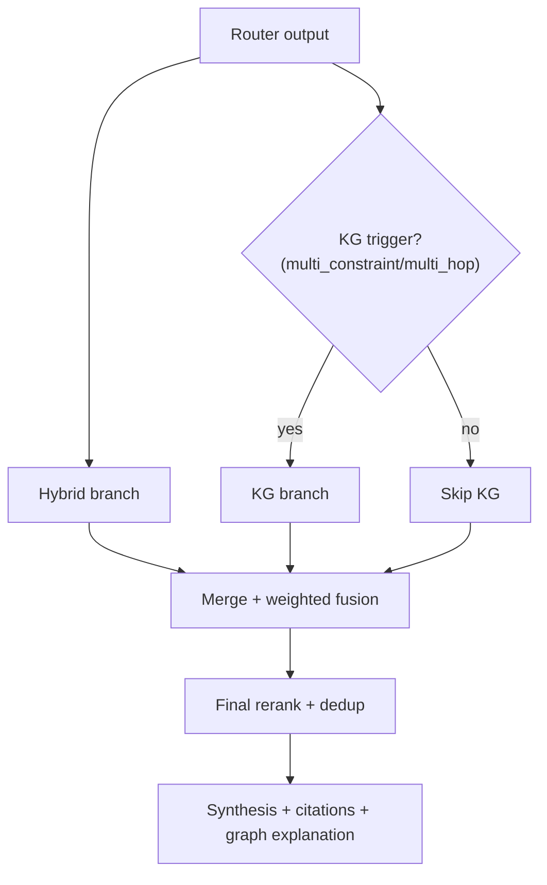

# Phase 3 PRD: Knowledge Graph Sidecar

## Document Metadata
- Version: 1.0
- Date: 2026-03-03
- Audience: Product + Engineering
- Phase window: W7-W9
- Release type: Big-bang

## 1) Context and Problem Statement
Phase 1 and Phase 2 improve evidence quality and routing, but multi-constraint and relationship-heavy requests still underperform when they require explicit structural reasoning.

Examples:
- "Fine, color-treated hair with dryness and scalp sensitivity — what should I use?"
- "What can replace product X but still be safe for treated hair?"

Vector/lexical retrieval can surface related passages but may miss strict intersections and explicit compatibility constraints. A knowledge graph sidecar addresses this by making entity-relationship reasoning first-class.

## 2) Goals, Non-Goals, and Success Criteria

### Goals
- Add a graph sidecar for `multi_constraint` and `multi_hop` queries.
- Improve correctness for compatibility/conflict and intersection logic.
- Keep explainability via matched graph paths and edge evidence.

### Non-Goals
- Do not replace hybrid retrieval as primary retrieval mode.
- No universal KG usage for all intents.
- No tenant-specific corpus partitioning.
- No replacement of shampoo/conditioner category-specific mapping logic with graph-only reasoning.

### Success Criteria
Primary targets:
- Multi-constraint query win-rate `>= +15pp` vs Phase 2 baseline.
- Constraint-miss rate `<= 5%` on curated graph test set.
- Explanation payload included for `>= 95%` of graph-assisted recommendations.

Grounding continuity:
- Citation-grounded factual claim coverage remains `>= 95%`.
- Unsupported factual claim rate remains `<= 3%`.

Guardrails:
- Latency: `TBD-L1`.
- Cost per answer: `TBD-C1`.

## 3) In-Scope and Out-of-Scope

### In Scope
- KG schema and ingestion for product/concern/ingredient/treatment relationships.
- Router-triggered KG branch.
- Merge/fusion policy for hybrid and KG candidates.
- Explanation payload contract for graph-derived recommendations.

### Out of Scope
- Full graph-native conversational engine.
- Automatic extraction of every edge from all transcripts without confidence thresholds.
- Cross-tenant graph partitioning.

## 4) Functional Requirements

| ID | Requirement |
|---|---|
| FR-1 | KG path is triggered only when router emits `complexity in {multi_constraint, multi_hop}` or explicit compatibility intent. |
| FR-2 | Hybrid retrieval remains mandatory baseline branch for graph-triggered queries. |
| FR-3 | Graph retriever must return candidates with matched constraints and edge evidence. |
| FR-4 | Merge layer must combine hybrid and graph candidates via deterministic weighted fusion. |
| FR-5 | Merge formula must be configurable without code changes (constants/config). |
| FR-6 | System must avoid duplicate products/chunks across branches before synthesis. |
| FR-7 | System must emit explanation payload including matched nodes/edges and confidence. |
| FR-8 | If KG fails, system must degrade gracefully to Phase 2 behavior. |
| FR-9 | Graph edge provenance must be retained (`source_evidence`) for auditability. |
| FR-10 | Graph ingestion must enforce idempotency and unique edge constraints. |
| FR-11 | KG branch must never bypass user-specific memory/profile isolation controls. |
| FR-12 | Recommendation output must remain citation-backed from shared corpus and graph evidence. |
| FR-13 | For shampoo/conditioner-classified requests, KG signals are additive and must not override deterministic category concern mappings already computed in pipeline. |
| FR-14 | Merge policy must retain category-specific product filters before applying KG boost weights. |

## 5) Non-Functional Requirements
- Explainability: every graph-assisted recommendation must include at least one human-readable reason.
- Reliability: KG retrieval errors must not fail entire response path.
- Data quality: low-confidence extracted edges excluded by threshold (`edge_confidence >= 0.75`).
- Security: no weakening of current RLS boundaries; graph writes are service-role only.
- Maintainability: graph edge types are enumerated in one shared schema definition.

## 6) Proposed Architecture and Mermaid Flow Diagram

### Architecture Overview
1. Router selects mode and complexity.
2. Hybrid branch always runs.
3. KG branch runs conditionally.
4. Branch outputs are fused and reranked.
5. Synthesis receives merged context and graph explanation payload.



## 7) Data Model and Interface/API/Type Changes

### Database Changes
Create migration: `supabase/migrations/20260303_phase3_kg_sidecar.sql`

Required tables/functions (if not already present):
- `graph_nodes`
- `graph_edges`
- `find_products_by_constraints(...)`
- Optional helper RPCs for conflict/safety retrieval

Schema boundary:
- Node types: `product`, `concern`, `ingredient`, `hair_texture`, `hair_type`, `treatment`, `category`, `routine_step`.
- Edge types: `addresses`, `suitable_for`, `contains`, `safe_for`, `conflicts_with`, `alternative_to`, `part_of_routine`, `belongs_to`.

### Interface Additions
`src/lib/rag/knowledge-graph.ts`
```ts
export interface GraphCandidate {
  productId: string
  matchScore: number
  matchedConstraints: string[]
  evidenceEdges: Array<{
    edgeType: string
    sourceNode: string
    targetNode: string
    confidence: number
    sourceEvidence?: string
  }>
}

export async function retrieveGraphCandidates(filters: {
  hair_texture?: string | null
  hair_type?: string | null
  concerns?: string[]
  treatments?: string[]
  category?: string | null
  limit?: number
}): Promise<GraphCandidate[]>
```

### Merge Contract
Deterministic merge score:
```text
final_score = 0.55 * hybrid_score + 0.30 * graph_score + 0.15 * authority_score
```

Notes:
- If KG not triggered or fails: `graph_score = 0` and hybrid path continues.
- Scores normalized to `[0,1]` before fusion.
- For shampoo/conditioner flows, category prefilter and mapped concerns are applied before fusion; KG only reorders/augments within eligible set.

### Explanation Payload Contract
Add optional payload in assistant message metadata:
```json
{
  "graph_explanations": [
    {
      "product_id": "...",
      "matched_constraints": ["texture:fein", "safe_for:gefaerbt"],
      "reason": "Product is suitable for fine hair and marked safe for color-treated use.",
      "evidence": ["edge:suitable_for", "edge:safe_for"]
    }
  ]
}
```

## 8) Telemetry and KPI Instrumentation

### Events
- `kg_triggered`
- `kg_skipped`
- `kg_retrieval_failed_fallback_hybrid`
- `kg_merge_completed`
- `kg_explanation_emitted`

Event dimensions:
- `complexity`
- `matched_constraint_count`
- `kg_candidate_count`
- `hybrid_candidate_count`
- `final_candidate_count`
- `kg_latency_ms`

### KPIs
- Multi-constraint win-rate.
- Constraint-miss rate.
- Graph explanation coverage.
- Branch failure/fallback rate.

## 9) Risks, Dependencies, and Mitigations

| Risk | Impact | Mitigation |
|---|---|---|
| Noisy edges degrade recommendation quality | High | Confidence gating + provenance checks + periodic edge audits |
| Merge scoring overweights KG and harms broad relevance | Medium | Offline calibration sweep before release |
| KG latency overhead | Medium | Trigger gating + query limits + index tuning |
| Incomplete graph coverage for some categories | Medium | Hybrid fallback as baseline, explicit coverage monitoring |
| Edge taxonomy drift over time | Medium | Central enum and migration guard checks |

Dependencies:
- Phase 2 router emits complexity and routing metadata.
- Product and content ingestion pipelines provide normalized entities.
- Graph backfill script for initial edge population.

## 10) Milestones and Phase Exit Criteria

### Milestones
| Milestone | Window | Deliverable |
|---|---|---|
| P3-M1 | W7 | Graph schema and indexes deployed to staging |
| P3-M2 | W7-W8 | KG retrieval library integrated with router triggers |
| P3-M3 | W8 | Merge/fusion and explanation payload integrated |
| P3-M4 | W8-W9 | Multi-constraint eval suite complete |
| P3-M5 | W9 | Big-bang production release |

### Exit Criteria
1. Multi-constraint win-rate `>= +15pp` vs Phase 2 baseline.
2. Constraint-miss rate `<= 5%`.
3. Explanation payload coverage `>= 95%` for KG-assisted outputs.
4. KG failure fallback to hybrid verified in controlled tests.
5. Grounding continuity metrics remain within targets.

## 11) Test Plan and Acceptance Scenarios

### Automated Tests
- Unit:
  - KG trigger policy tests.
  - Merge score normalization and deterministic ordering tests.
  - Explanation payload formatter tests.
- Integration:
  - Graph query RPC contract tests.
  - Hybrid+KG merge tests with duplicate candidate overlap.
- E2E:
  - Multi-constraint recommendation journey with graph explanations and citations.

### Required Acceptance Scenarios
1. Multi-constraint recommendation query returns intersected evidence and higher-ranked compatible products.
2. Simple factual query bypasses KG and stays fully cited.
3. Low-confidence router path still requests clarification before KG invocation.
4. User memory remains user-scoped when KG path is active.
5. Baseline-vs-phase retrieval report shows required improvement for target query class.
6. KG subsystem disabled test confirms reliable fallback to Phase 2 path.
7. Shampoo/conditioner recommendation paths remain category-constrained when KG is enabled.

## 12) Rollout, Rollback, and Post-Launch Checks

### Rollout Plan (Big-Bang)
1. Deploy KG schema and backfilled edges.
2. Deploy app code with KG trigger and merge logic.
3. Enable KG sidecar globally for eligible queries.
4. Monitor 72h for fallback rate, multi-constraint quality, and grounding health.

### Rollback Checklist
1. Disable KG trigger route globally.
2. Keep hybrid retrieval fully active.
3. Preserve graph data for diagnostics; no destructive rollback required.
4. Validate product recommendation flows and citation integrity.

### Post-Launch Checks
- Weekly graph edge quality audit (sampled by category).
- Weekly merge-weight review with fixed holdout set.
- Capture top failed KG queries for Phase 4 tuning loop.

## 13) Implementation Task List

### ⚠️ BLOCKER: Product Data Enrichment Required First

> **Status: BLOCKED** — Phase 3 KG implementation is paused until product data is enriched.
>
> During task breakdown (2026-03-03), a data audit revealed that the `products` table
> is too thin to make the KG meaningfully better than the existing `matchProducts()` array
> overlap scoring. The KG's value comes from multi-constraint intersection — that requires
> richer product attributes than currently exist.

#### Current product data (what we have)

| Column | Values | Edge type it enables |
|--------|--------|---------------------|
| `suitable_hair_textures text[]` | fine/normal/coarse | `suitable_for` → thickness |
| `suitable_concerns text[]` | 11 English slugs (schuppen, trocken, protein, etc.) | `addresses` → concern |
| `category text` | Shampoo, Conditioner (Drogerie), Leave-in, Maske, Oele | `belongs_to` → category |

Only 3 edge types from 3 columns across 216 drogerie products.

#### Missing product data (what we need)

| New column | Values | Edge type it enables | Priority |
|-----------|--------|---------------------|----------|
| `suitable_hair_patterns text[]` | straight/wavy/curly/coily | `suitable_for` → pattern | High |
| `safe_for_treatments text[]` | natural/colored/bleached | `safe_for` → treatment | High |
| `suitable_scalp_types text[]` | oily/balanced/dry | `suitable_for` → scalp_type | Medium (shampoos) |
| `key_ingredients text[]` | e.g. keratin, silicone, coconut oil | `contains` → ingredient | Deferred |

#### What the owner needs to do before Phase 3 resumes

1. **Decide** which new columns to add (see table above).
2. **Populate** new columns for all 216 products (Excel export → fill → re-import recommended).
3. **Signal ready** — then we pick up from Phase 3a below.

### Decisions Locked In

- **Ingredients**: Skip entirely in Phase 3 — no ingredient data exists, defer to future enrichment
- **Hair pattern nodes**: Deferred until `suitable_hair_patterns` column is added to products
- **Graph storage**: Plain Postgres tables (`graph_nodes`, `graph_edges`) — no external graph DB
- **Edge confidence threshold**: `0.75` — edges below this are excluded from traversal (PRD NFR)
- **Merge formula**: `final_score = 0.55 * hybrid_score + 0.30 * graph_score + 0.15 * authority_score` (PRD §7)
- **KG trigger**: `complexity in {multi_constraint, multi_hop}` OR `retrieval_mode = hybrid_plus_graph` (PRD FR-1)
- **KG merge point**: Product matcher only — KG augments `matchProducts()`, not `retrieveContext()`. Content retrieval stays hybrid-only.
- **Backend vocabulary**: English everywhere. Migrate `hair_profiles.concerns` from German strings to English slugs (matching product slugs). German stays UI-only.
- **Population**: Automated from `products` table columns — no LLM extraction yet
- **Graceful degradation**: KG failure falls back to Phase 2 behavior (hybrid-only) via try/catch — no feature flag

### Phase 3a — Product Data Enrichment + Vocab Standardization

> Prerequisite work before KG tasks can begin. Bundled as one coordinated change.

#### #0a — Add new columns to products table
- SQL migration: add `suitable_hair_patterns text[]`, `safe_for_treatments text[]`, `suitable_scalp_types text[]` to `products`
- Add GIN indexes on new array columns
- Update TS `Product` type and Zod validators
- **Owner populates data** (Excel export → fill → re-import script)

#### #0b — Standardize backend vocabulary to English
- Migrate `hair_profiles.concerns` from German strings to English slugs
- Create mapping: `Haarausfall → hair_loss`, `Schuppen → dandruff`, `Trockenheit → dryness`, etc.
- SQL migration: update all existing rows + update CHECK constraints
- Update onboarding UI to write English slugs (German stays display-only)
- Update all TS code that reads `concerns` to use new English values
- Align product `suitable_concerns` slugs with new canonical vocab if needed
- Verify pipeline concern mapping still works (shampoo scalp mapping, conditioner protein/moisture mapping)

### Phase 3b — KG Implementation (blocked by 3a)

### Task Dependency Graph

```
Phase 3a — Prerequisites (sequential)
  #0a Product data enrichment (columns + population)
  #0b Vocab standardization (English backend)
        │
Phase 3b — KG build
        │
  Layer 1 — Foundations (parallel, blocked by #0a + #0b)
    #1  SQL migration (tables, indexes, RPC)
    #2  Extend TypeScript types
    #3  Graph population script
          │
  Layer 2 — Core KG retrieval (blocked by #1, #2)
    #4  knowledge-graph.ts: retrieveGraphCandidates + helpers
          │
  Layer 3 — Router + pipeline integration (blocked by #2, #4)
    #5  Router rule: set hybrid_plus_graph mode
    #6  Pipeline KG branch + weighted merge into product matcher
    #7  Graph explanation payload + SSE enrichment
          │
  Layer 4 — Telemetry (blocked by #6)
    #8  KG telemetry events
          │
  Layer 5 — Validation (blocked by #6, #7, #8)
    #9  Multi-constraint eval suite
    #10 Non-regression tests
```

### Tasks

#### #1 — SQL migration: graph_nodes, graph_edges, indexes, constraint RPC
- Create `supabase/migrations/20260303_phase3_kg_sidecar.sql`
- `graph_nodes` table: `id uuid PK`, `node_type text` (CHECK: product/concern/hair_texture/hair_pattern/treatment/category/scalp_type/routine_step), `name text`, `name_normalized text GENERATED`, `external_id uuid` (FK to products.id for product nodes), `properties jsonb`
- `graph_edges` table: `id uuid PK`, `source_id uuid FK`, `target_id uuid FK`, `edge_type text` (CHECK: addresses/suitable_for/part_of_routine/recommended_by/alternative_to/safe_for/belongs_to), `weight float DEFAULT 1.0`, `source_evidence text`, `properties jsonb`
- Note: `contains`, `conflicts_with`, `helps_with` edge types deferred (no ingredient data)
- UNIQUE constraints: `(node_type, name_normalized)` on nodes, `(source_id, target_id, edge_type)` on edges
- Indexes: node_type, name_normalized, external_id (partial), source_id, target_id, edge_type
- `find_products_by_constraints(p_hair_texture, p_hair_pattern, p_concerns, p_treatments, p_scalp_type, p_max_results)` RPC — multi-constraint intersection scoring
- RLS: service-role only writes; read access for authenticated users (or SECURITY DEFINER on RPC)
- **Ref**: PRD §7, FR-3, FR-9, FR-10
- **Blocked by**: #0a, #0b

#### #2 — Extend TypeScript types for KG
- Add `GraphCandidate` interface: `productId`, `matchScore`, `matchedConstraints`, `evidenceEdges[]` (with `edgeType`, `sourceNode`, `targetNode`, `confidence`, `sourceEvidence?`)
- Add `GraphExplanation` interface: `product_id`, `matched_constraints`, `reason`, `evidence`
- Add `graph_score?: number` to product matching results
- Add `graph_explanations?: GraphExplanation[]` to SSE metadata / message context
- **Ref**: PRD §7, FR-3, FR-7
- **Blocked by**: #0b (vocab must be standardized first)

#### #3 — Graph population script
- Create `scripts/populate-knowledge-graph.ts`
- Step 1: Seed attribute nodes — thickness (fine/normal/coarse), hair_pattern (straight/wavy/curly/coily), concerns (English slugs), treatments (natural/colored/bleached), scalp_types (oily/balanced/dry), routine_steps, categories
- Step 2: Load all active products → create product nodes with `external_id` → link products.id
- Step 3: Create edges from product columns:
  - `suitable_hair_textures` → `suitable_for` → thickness nodes
  - `suitable_hair_patterns` → `suitable_for` → pattern nodes
  - `suitable_concerns` → `addresses` → concern nodes
  - `safe_for_treatments` → `safe_for` → treatment nodes
  - `suitable_scalp_types` → `suitable_for` → scalp_type nodes
  - `category` → `belongs_to` → category nodes
- Idempotent: use `upsert` with `onConflict` on unique constraints (FR-10)
- Dry-run mode: `--dry-run` flag to preview without writing
- Summary output: node/edge counts per type
- **Ref**: PRD FR-10, §7 (schema boundary)
- **Run**: `npx tsx scripts/populate-knowledge-graph.ts`
- **Blocked by**: #0a, #0b, #1

#### #4 — Implement knowledge-graph.ts: retrieveGraphCandidates + helpers
- Create `src/lib/rag/knowledge-graph.ts`
- `retrieveGraphCandidates(filters)` → calls `find_products_by_constraints` RPC, maps to `GraphCandidate[]`, fetches evidence edges for top results
- `findAlternatives(productName, maxResults)` → traverses `alternative_to` edges
- `buildGraphExplanations(candidates)` → generates human-readable `GraphExplanation[]` from matched constraints and evidence edges
- All functions: on error, log and return empty array (FR-8 graceful degradation)
- Filter by `edge_confidence >= 0.75` threshold (configurable in retrieval-constants)
- **Ref**: PRD FR-3, FR-7, FR-8, FR-9
- **Blocked by**: #1, #2

#### #5 — Router rule: set hybrid_plus_graph mode for complex queries
- Add rule in `router.ts` between Rule 2 (FAQ shortcut) and Rule 3 (category-specific):
  - If `complexity in {multi_constraint, multi_hop}` AND intent is context-sensitive → set `retrieval_mode = "hybrid_plus_graph"`, push override `"kg_complexity_upgrade"`
- For shampoo/conditioner: Rule 3 (`product_sql_plus_hybrid`) takes priority over KG mode — KG runs as sidecar but does not replace category routing (FR-13, FR-14)
- Adjust Rule 7 fallback logic to account for new mode
- **Ref**: PRD FR-1, FR-2, FR-13, FR-14
- **Blocked by**: #2

#### #6 — Pipeline KG branch + weighted merge into product matcher
- KG merges into **product matching** (not content retrieval — decision locked in above)
- In `pipeline.ts`, after `matchProducts()`:
  - Check KG trigger: `routerDecision.retrieval_mode === "hybrid_plus_graph"` OR `classification.complexity in {multi_constraint, multi_hop}`
  - If triggered: call `retrieveGraphCandidates()` with user profile constraints
- Merge logic: normalize scores to `[0,1]`, apply `final_score = 0.55 * hybrid + 0.30 * graph + 0.15 * authority`
- For shampoo/conditioner: apply category prefilter before merge — KG only reorders/augments within eligible set (FR-14)
- Dedup: same product from matchProducts + KG → keep highest fused score, merge evidence (FR-6)
- On KG failure: catch error, log, continue with matchProducts-only results (FR-8)
- Pass `graph_explanations` to synthesizer context
- Extract merge constants to `retrieval-constants.ts`: `KG_HYBRID_WEIGHT`, `KG_GRAPH_WEIGHT`, `KG_AUTHORITY_WEIGHT`
- **Ref**: PRD FR-2, FR-4, FR-5, FR-6, FR-8, FR-11, FR-13, FR-14
- **Blocked by**: #4, #5

#### #7 — Graph explanation payload + SSE enrichment
- SSE: add optional `graph_explanations` field to `sources` or `done` event
- Explanation format: `{ product_id, matched_constraints, reason, evidence }` per PRD §7
- `reason` field: auto-generated sentence from matched constraints (e.g., "Suitable for fine hair and safe for color-treated use.")
- Synthesis prompt: inject graph explanations into system context so LLM can reference structural reasoning
- Backward compatible: new fields are additive/optional (FR-12, existing clients unaffected)
- **Ref**: PRD FR-7, FR-12, §7
- **Blocked by**: #4, #6

#### #8 — KG telemetry events
- Emit structured events: `kg_triggered`, `kg_skipped`, `kg_retrieval_failed_fallback_hybrid`, `kg_merge_completed`, `kg_explanation_emitted`
- Event dimensions: `complexity`, `matched_constraint_count`, `kg_candidate_count`, `hybrid_candidate_count`, `final_candidate_count`, `kg_latency_ms`
- Use existing telemetry pattern from Phase 1/2 (`emitRetrievalEvent` / `emitRouterEvent` style)
- Add KG constants to `retrieval-constants.ts`: `KG_EDGE_CONFIDENCE_THRESHOLD`, `KG_MAX_CANDIDATES`, merge weights
- **Ref**: PRD §8
- **Blocked by**: #6

#### #9 — Multi-constraint eval suite
- Build eval set: 15-20 multi-constraint queries with known-relevant products and expected constraint coverage
- Eval script computes: multi-constraint win-rate vs Phase 2 baseline (`>= +15pp`), constraint-miss rate (`<= 5%`), explanation coverage (`>= 95%`)
- Compare: hybrid-only vs hybrid+KG retrieval paths
- Output: comparison report with per-query breakdown
- **Ref**: PRD §2, §10, §11
- **Blocked by**: #6, #7

#### #10 — Non-regression tests
- KG trigger: policy correctly sets `hybrid_plus_graph` for multi_constraint/multi_hop
- KG skip: simple queries bypass KG entirely
- KG failure fallback: induced KG error → system returns matchProducts-only results without crash
- Shampoo path: scalp concern mapping + category prefilter preserved when KG active (FR-13)
- Conditioner path: protein/moisture mapping + category prefilter preserved when KG active (FR-14)
- Merge determinism: same inputs → same fused scores
- Explanation payload: present for KG-assisted results, absent for hybrid-only
- User memory isolation: `user_id` filtering intact when KG branch active (FR-11)
- SSE payload shape: existing events work, new `graph_explanations` field optional
- Citation integrity: all recommendations remain citation-backed (FR-12)
- **Ref**: PRD §11, FR-8, FR-11, FR-12, FR-13, FR-14
