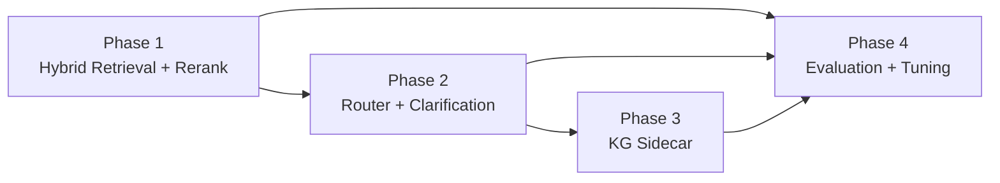

# AI Search Rollout PRD Pack (4 Phases)

## Document Metadata
- Version: 1.0
- Date: 2026-03-03
- Audience: Product + Engineering
- Scope baseline: Shared influencer corpus + user-private profile/memory (no tenant-isolated corpus)
- Release policy: Big-bang per phase with explicit exit and rollback gates

## 1) One-Page Summary

| Phase | Primary Objective | Key Deliverables | Primary Quality Targets | Release Gate |
|---|---|---|---|---|
| Phase 1 | Hybrid retrieval + reranking | Vector + lexical retrieval, RRF fusion, rerank stage, richer source payload | `nDCG@10 >= 0.72`, `Recall@20 >= 0.88`, citation-grounded claim coverage `>= 95%` | All Phase 1 exit criteria green for 2 consecutive runs |
| Phase 2 | Intent router + clarification policy | Enriched classification schema, routing modes, clarification trigger policy, fail-safe defaults | Router mode accuracy `>= 90%`, clarification precision `>= 85%`, unnecessary clarification rate `<= 10%` | Routing/clarification eval suite passes with no grounding regression |
| Phase 3 | Knowledge graph sidecar | KG trigger layer, graph retrieval branch, hybrid+graph merge contract, explanation payload | Multi-constraint query win-rate `>= +15pp` vs Phase 2 baseline, constraint-miss rate `<= 5%` | KG acceptance suite + regression suite pass |
| Phase 4 | Evaluation and tuning system | Offline eval set, online monitoring, A/B framework, regression gates, tuning loop | Grounded answer score `>= 4.3/5`, unsupported factual claim rate `<= 2%`, quality delta `>= +8%` vs pre-Phase baseline | Phase 4 KPI dashboards and release gate automation live |

Guardrail metrics (all phases):
- Latency: `TBD-L1` (to be finalized after first complete instrumented baseline run)
- Cost per answer: `TBD-C1` (to be finalized after first complete instrumented baseline run)

## 2) Dependency Map and Reading Order

Recommended reading order:
1. [01-phase-1-hybrid-rerank-prd.md](./01-phase-1-hybrid-rerank-prd.md)
2. [02-phase-2-router-clarification-prd.md](./02-phase-2-router-clarification-prd.md)
3. [03-phase-3-kg-sidecar-prd.md](./03-phase-3-kg-sidecar-prd.md)
4. [04-phase-4-eval-ab-prd.md](./04-phase-4-eval-ab-prd.md)

## 3) Cross-Phase API and Type Changes (Reference)

These changes are intentionally repeated in phase docs where they first become required.

| Artifact | Change |
|---|---|
| `ClassificationResult` | Add `complexity`, `needs_clarification`, `retrieval_mode`, `normalized_filters`, `router_confidence` |
| Retriever interface | Add `subqueries`, `candidateCount`, `includeKeyword`, `rerankTopN`, `userId` |
| Optional KG interface | `retrieveGraphCandidates(filters)` and merge payload contract |
| SSE events | Add/standardize `sources`, `confidence`, `retrieval_debug` |
| Backward compatibility | Existing `content_delta`, `product_recommendations`, `done`, `error` remain supported |

## 3.1) Category-Specific Non-Regression Contract (Shampoo/Conditioner)

These rules are mandatory across all 4 phases and are not replaced by the new architecture:

1. Keep `product_category` classification output and downstream branching (`shampoo`, `conditioner`) intact.
2. Preserve shampoo concern mapping from scalp profile (`scalp_type`/`scalp_condition`) to concern codes.
3. Preserve conditioner concern mapping from `protein_moisture_balance` to concern codes.
4. Preserve category-aware metadata filtering in knowledge retrieval for `product_recommendation` queries.
5. Preserve category pre-filtering in product matching (`shampoo` and `conditioner` DB category mappings).
6. Preserve category-specific synthesis instructions and section headers in final responses.
7. Any phase implementation that changes the above must include an explicit migration and non-regression test evidence.

## 4) Consolidated Milestone Timeline

Timeline uses relative weeks after kickoff (`W0`).

| Milestone | Target Window | Exit Condition |
|---|---|---|
| M1: Retrieval foundations complete | W0-W2 | Hybrid retrieval path available behind feature flag in staging |
| M2: Phase 1 production release | W3 | Phase 1 exit criteria pass and rollback runbook validated |
| M3: Router + clarification complete | W4-W5 | Routing and clarification evaluation gates pass |
| M4: Phase 2 production release | W6 | Phase 2 big-bang release checklist completed |
| M5: KG sidecar integration complete | W7-W8 | Multi-constraint quality target achieved in eval suite |
| M6: Phase 3 production release | W9 | Phase 3 release gate passed and rollback simulation clean |
| M7: Eval/tuning platform complete | W10-W11 | Dashboards + automated regression gates active |
| M8: Phase 4 production release | W12 | Final quality gate and governance checklist complete |

## 5) Consolidated Risk Register

| Risk ID | Risk | Affected Phases | Impact | Mitigation |
|---|---|---|---|---|
| R1 | Hybrid retrieval increases latency beyond user tolerance | P1, P2, P3 | Medium | Cap candidate pool, async prefetch where possible, enforce rerank candidate ceiling |
| R2 | Router over-asks clarifying questions | P2 | Medium | Confidence thresholds + weekly false-positive audit |
| R3 | Router under-asks and guesses | P2, P3 | High | Slot-completeness checks and hard clarification triggers |
| R4 | KG branch returns noisy edges from low-confidence extractions | P3 | High | Evidence thresholding, edge provenance, confidence-weighted fusion |
| R5 | Evaluation set becomes stale relative to live traffic | P4 | Medium | Monthly refresh cadence and drift alerts |
| R6 | Grounding degrades when context window is over-packed | P1-P4 | High | Context packing budget and source-priority policy |
| R7 | User memory retrieval leakage across users | P1-P4 | Critical | Strict `user_id` filters + isolation tests in CI |
| R8 | Metric gaming without real quality improvement | P4 | Medium | Human-judged holdout set and adversarial test suite |

## 6) Consolidated Decision Log

| Decision ID | Date | Decision | Rationale |
|---|---|---|---|
| D1 | 2026-03-03 | Use latest 4-phase rollout model | Matches current architecture trajectory and reduces coordination overhead |
| D2 | 2026-03-03 | English docs, implementation-ready detail | Maximizes engineering precision and partner readability |
| D3 | 2026-03-03 | Shared corpus + user-private memory/profile | Fits current product model and current schema |
| D4 | 2026-03-03 | Big-bang release per phase | Simpler operational model for this team size |
| D5 | 2026-03-03 | Numeric quality targets now; latency/cost as TBD guardrails | Quality-first strategy with measurable progress |
| D6 | 2026-03-03 | Include Mermaid diagrams per phase PRD | Improves shared understanding between product and engineering |

## 7) Links to Phase PRDs
- [Phase 1 PRD: Hybrid Retrieval + Reranking](./01-phase-1-hybrid-rerank-prd.md)
- [Phase 2 PRD: Intent Router + Clarification](./02-phase-2-router-clarification-prd.md)
- [Phase 3 PRD: Knowledge Graph Sidecar](./03-phase-3-kg-sidecar-prd.md)
- [Phase 4 PRD: Evaluation, Experimentation, and Tuning](./04-phase-4-eval-ab-prd.md)
