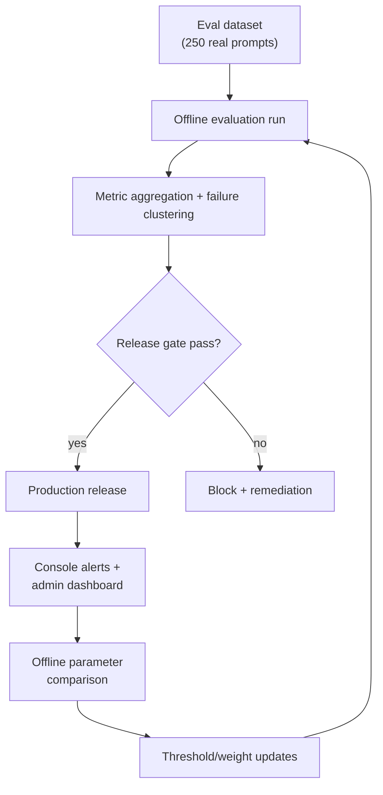

# Phase 4 PRD: Evaluation, Experimentation, and Tuning

## Document Metadata
- Version: 1.1 (updated with implementation decisions)
- Date: 2026-03-03
- Audience: Product + Engineering
- Phase window: W10-W12
- Release type: Big-bang

## 1) Context and Problem Statement
After Phases 1-3, architecture quality should improve, but sustained quality requires a repeatable measurement and tuning system. Without standardized offline/online evaluation, regressions can pass unnoticed and tuning can optimize the wrong metrics.

Phase 4 establishes a permanent evaluation operating model with regression gates before release.

## 2) Goals, Non-Goals, and Success Criteria

### Goals
- Build a robust offline evaluation suite using real query data (no synthetic prompts).
- Define online monitoring with console-based alerting.
- Automate release regression gates based on quality and grounding metrics.
- Establish a regular offline tuning loop for retriever/router/reranker thresholds.

### Non-Goals
- Rewriting existing chat UI.
- Introducing monthly/yearly pricing changes.
- Replacing current telemetry provider stack.

### Success Criteria
Primary targets:
- Grounded answer quality score `>= 3.8/5` initial gate (ratchet toward `4.3/5` quarterly).
- Unsupported factual claim rate `<= 2%`.
- Citation-grounded factual claim coverage `>= 96%`.
- Aggregate quality delta `>= +8%` vs pre-Phase baseline.

Guardrails:
- Latency: `TBD-L1`.
- Cost per answer: `TBD-C1`.

## 3) In-Scope and Out-of-Scope

### In Scope
- Offline eval dataset (250 real prompts), scoring rubric, and run pipeline.
- Lightweight admin dashboard + console-based alerting.
- Offline parameter comparison for tuning candidates (no live traffic splitting).
- Release gating policy tied to metrics.

### Out of Scope
- New retrieval mode development (handled in prior phases).
- New graph schema/edge taxonomy design.
- New customer analytics product surfaces.
- Live A/B traffic splitting (defer until user traffic justifies it).
- Synthetic eval prompt generation (dataset uses only verified real data).

## 4) Functional Requirements

| ID | Requirement |
|---|---|
| FR-1 | System must maintain a versioned offline eval set with intent and complexity labels. |
| FR-2 | Offline eval set must include 250 real prompts (230 Q&A pairs + 20 retrieval gold set) across all intents and complexity classes. No synthetic generation. |
| FR-3 | Eval harness must run end-to-end pipeline and capture retrieval, routing, grounding, and UX quality signals. |
| FR-4 | System must compute regression gates automatically per candidate release. |
| FR-5 | Release must block when critical quality gates fail. |
| FR-6 | Monitoring must include dashboard views for quality, grounding, latency, and fallback rates. |
| FR-7 | Offline parameter comparison must support running eval with different config snapshots and producing side-by-side metric reports. |
| FR-8 | Tuning loop must produce weekly parameter proposals with auditable before/after metrics. |
| FR-9 | Evaluation outputs must include drill-down for failed cases by intent and retrieval mode. |
| FR-10 | Rollback policy must trigger automatically for severe quality degradation after release. |
| FR-11 | Evaluation suite must include explicit shampoo and conditioner slices with category-specific non-regression gates. |
| FR-12 | Any tuning change that reduces shampoo/conditioner slice quality by more than `1.0pp` fails release gate unless formally approved with rollback plan. |

## 5) Non-Functional Requirements
- Reproducibility: eval results are reproducible from immutable dataset and config snapshots.
- Traceability: each release decision ties to a specific eval run ID.
- Security: no raw user PII in offline eval artifacts unless explicitly anonymized.
- Availability: lightweight admin dashboard and console alerts available to operators.
- Maintainability: threshold configs managed in version-controlled files.

## 6) Proposed Architecture and Mermaid Flow Diagram

### Architecture Overview
1. Collect real prompts (230 Q&A + 20 retrieval gold set) and normalize labels.
2. Run offline harness against candidate build.
3. Score and compare against baseline.
4. Apply release gate policy.
5. After release, monitor via console alerts and admin dashboard.
6. Run offline parameter comparison to produce tuning proposals.



## 7) Data Model and Interface/API/Type Changes

### Proposed Evaluation Storage
Create migration: `supabase/migrations/20260303_phase4_eval_framework.sql`

Proposed tables:
- `eval_datasets`
  - `id`, `name`, `version`, `description`, `created_at`
- `eval_cases`
  - `id`, `dataset_id`, `prompt`, `intent_label`, `complexity_label`, `expected_constraints`, `expected_sources`, `category_slice` (nullable), `relevant_chunk_ids` (nullable — retrieval gold set only), `reference_answer` (nullable — Tom's original answer for Q&A pairs)
- `eval_runs`
  - `id`, `dataset_id`, `git_sha`, `config_snapshot`, `status`, `started_at`, `completed_at`
- `eval_results`
  - `id`, `run_id`, `case_id`, `metrics jsonb`, `pass boolean`, `failure_tags text[]`
- `release_gates`
  - `id`, `run_id`, `gate_name`, `threshold`, `actual_value`, `passed`

### Interface/Type Additions
`src/lib/types.ts` (or dedicated eval types file):
```ts
export interface RetrievalDebugEvent {
  retrieval_mode: string
  candidate_count: number
  final_context_count: number
  confidence?: number
}

export interface EvalGateResult {
  gate: string
  threshold: number | string
  actual: number | string
  passed: boolean
}
```

### API Surface
- `POST /api/admin/evals/run` to trigger eval run.
- `GET /api/admin/evals/:id` to view gate outcomes.
- `GET /api/admin/evals/:id/failures` for failure clusters.

Backward compatibility:
- Eval/admin APIs are additive and do not change end-user chat endpoints.

## 8) Telemetry and KPI Instrumentation

### Core Metrics
- Retrieval: `nDCG@10`, `Recall@20`, retrieval mode distribution.
- Routing: mode accuracy, clarification precision/recall.
- Grounding: citation coverage, unsupported claim rate.
- Outcome quality: LLM-as-judge composite score (GPT-4o, 1-5 rubric), human audit on sampled subset.
- Operations: p50/p95 latency, estimated cost per answer, fallback rates.
- Category-slice quality: shampoo and conditioner specific relevance, constraint adherence, and mapped-concern hit rate.

### Alerting Policy (console logs only)
- Critical alert: unsupported claim rate exceeds threshold by `> 1pp` for 2 consecutive eval runs.
- High alert: citation coverage drops below threshold for 2 eval runs.
- Medium alert: fallback rates double from previous eval run baseline.
- Delivery: structured JSON to console (same pattern as `retrieval-telemetry.ts`). External delivery channel deferred.

## 9) Risks, Dependencies, and Mitigations

| Risk | Impact | Mitigation |
|---|---|---|
| Eval set not representative of live traffic | High | Grow dataset organically with real data; monthly drift checks |
| LLM-as-judge scoring inconsistency | Medium | Rubric calibration against human audit sample |
| Excessive gate strictness blocks delivery | Medium | Ratchet strategy (start 3.8, quarterly increase) + tiered gates (critical vs warning) |
| Offline comparison doesn't capture real-world variance | Medium | Run full pipeline per prompt (not mocked); defer live A/B until traffic justifies |
| Dashboard blind spots for silent failures | High | Pair aggregate metrics with failure cluster drill-down |

Dependencies:
- Phase 1-3 telemetry events in place.
- Admin access paths and auth checks operational.
- Stable CI/CD integration for gate enforcement.
- Existing eval foundation: `scripts/eval-retrieval.ts`, `tests/fixtures/qa-pairs.json` (230 Q&A), `tests/fixtures/retrieval-gold-set.json` (20 entries).

## 10) Milestones and Phase Exit Criteria

### Milestones
| Milestone | Window | Deliverable |
|---|---|---|
| P4-M1 | W10 | Eval schema + dataset seeded + harness baseline implemented (#1-#4) |
| P4-M2 | W10-W11 | Metric calculators + release gate engine operational (#5-#6) |
| P4-M3 | W11 | Admin eval API + lightweight dashboard + console alerts (#7-#8) |
| P4-M4 | W11-W12 | Offline parameter comparison + validation complete (#9-#10) |
| P4-M5 | W12 | Big-bang production release |

### Exit Criteria
1. Offline eval run is reproducible and automated against 250-prompt dataset.
2. Gate policy is enforced in release workflow (CI script exits non-zero on critical failure).
3. Initial quality gate (`>= 3.8/5.0`) is met on latest run.
4. Lightweight admin dashboard and console alerts verified in production.
5. Offline parameter comparison process documented and operational.

## 11) Test Plan and Acceptance Scenarios

### Automated Tests
- Unit:
  - Metric calculator correctness.
  - Gate evaluation logic for pass/fail edge conditions.
- Integration:
  - Full eval run lifecycle (trigger -> execute -> persist -> gate output).
  - Console alert emission tests (structured log assertions).
- E2E:
  - Candidate release blocked when critical gate fails.

### Required Acceptance Scenarios
1. Multi-constraint recommendation case shows measurable quality gain vs baseline.
2. Simple factual query remains fully cited and free of unsupported claims.
3. Low-confidence router cases are correctly reflected in eval outcomes.
4. User-specific memory isolation checks are included in regression suite and pass.
5. Retrieval regression report compares baseline and candidate using fixed eval prompts.
6. Rollback drill demonstrates quick reversion when post-release gate breach occurs.
7. Shampoo and conditioner slice regressions are blocked by non-regression gate.

## 12) Rollout, Rollback, and Post-Launch Checks

### Rollout Plan (Big-Bang)
1. Deploy evaluation schema, APIs, and lightweight admin dashboard.
2. Run first production-grade baseline eval and lock initial thresholds (quality gate at 3.8).
3. Enable release gate enforcement for deployment workflow.
4. Enable console alerts and document offline tuning review cadence.

### Rollback Checklist
1. Disable blocking gates in CI/CD (switch to warn-only mode).
2. Keep metric collection active.
3. Revert dashboard or alert config changes if causing operational noise.
4. Document rollback reason and remediation timeline.

### Post-Launch Checks
- T+1 day: verify alert correctness and gate behavior.
- T+7 days: review first weekly tuning cycle outcomes.
- T+30 days: refresh eval dataset sample and revalidate thresholds.

## 13) Implementation Task List

### Decisions Locked In
- **Eval storage**: Supabase tables (`eval_datasets`, `eval_cases`, `eval_runs`, `eval_results`, `release_gates`) ✅
- **Automated quality scoring**: LLM-as-judge (GPT-4o) with structured 1-5 rubric — human audit on sampled subset ✅
- **No live A/B**: Offline eval comparison only (run parameter variants against eval dataset, compare metrics). No live traffic splitting — defer until traffic justifies it ✅
- **Dashboard**: Hybrid — script-generated reports for CI + lightweight admin page listing runs and pass/fail ✅
- **Alert delivery**: Console logs only (structured JSON, same pattern as `retrieval-telemetry.ts`) ✅
- **CI gate integration**: Script-based (`scripts/eval-release-gate.ts`), exits non-zero on critical gate failure ✅
- **Quality gate ratchet**: Start critical gate at `>= 3.8/5.0`, increase quarterly toward PRD target `4.3/5.0` ✅
- **Eval dataset**: 250 real prompts only (230 existing Q&A pairs + 20 retrieval gold set). No synthetic generation. Grow organically as real data arrives ✅
- **Chunk annotation**: Only the 20 retrieval gold set entries get `relevant_chunk_ids` annotation. The 230 Q&A pairs are evaluated on answer quality (LLM-as-judge) not retrieval ranking ✅
- **Existing foundation**: `scripts/eval-retrieval.ts` (nDCG/Recall/MRR), `tests/fixtures/retrieval-gold-set.json` (20 entries, unannotated), `tests/fixtures/qa-pairs.json` (230 Q&A pairs), `src/lib/rag/retrieval-telemetry.ts`, `src/lib/rag/retrieval-constants.ts`

### Task Dependency Graph

```
Layer 1 — Foundations (parallel)
  #1  SQL migration (eval tables)
  #2  Extend TypeScript types
  #3  Prepare eval dataset (250 real prompts)
        │
Layer 2 — Core eval engine (blocked by #1, #2, #3)
  #4  Eval harness: batch pipeline runner
        │
Layer 3 — Metrics + gates (blocked by #4)
  #5  Metric calculators (retrieval + grounding + quality)
        │
Layer 4 — Enforcement + API (blocked by #5)
  #6  Release gate engine
  #7  Admin eval API routes
        │
Layer 5 — Monitoring + tuning (blocked by #6, #7)
  #8  Dashboard + console alerts
  #9  Offline parameter comparison
        │
Layer 6 — Validation (blocked by #8, #9)
  #10  End-to-end validation + non-regression
```

### Tasks

#### #1 — SQL migration: eval framework tables
- Create `supabase/migrations/20260303_phase4_eval_framework.sql`
- Table `eval_datasets`: `id uuid`, `name text`, `version text`, `description text`, `created_at timestamptz`
- Table `eval_cases`: `id uuid`, `dataset_id uuid FK`, `prompt text`, `intent_label text`, `complexity_label text`, `expected_constraints jsonb`, `expected_sources jsonb`, `category_slice text` (nullable — `shampoo`, `conditioner`, etc.), `relevant_chunk_ids text[]` (nullable — only populated for retrieval gold set entries), `reference_answer text` (nullable — Tom's original answer for Q&A pairs)
- Table `eval_runs`: `id uuid`, `dataset_id uuid FK`, `git_sha text`, `config_snapshot jsonb`, `status text`, `started_at timestamptz`, `completed_at timestamptz`
- Table `eval_results`: `id uuid`, `run_id uuid FK`, `case_id uuid FK`, `metrics jsonb`, `pass boolean`, `failure_tags text[]`
- Table `release_gates`: `id uuid`, `run_id uuid FK`, `gate_name text`, `threshold numeric`, `actual_value numeric`, `passed boolean`
- RLS policies: admin-only access matching existing pattern
- **Ref**: PRD Section 7, FR-1, FR-2

#### #2 — Extend TypeScript types for eval framework
- Add types: `EvalCase`, `EvalRun`, `EvalResult`, `EvalGateResult` (per PRD Section 7)
- Add `RetrievalDebugEvent` type (already in PRD, not yet used at runtime)
- Add `QualityRubricScore` type for LLM-as-judge output: `relevance`, `accuracy`, `completeness`, `citation_quality`, `composite`
- Add `ParameterComparisonResult` type for offline tuning comparisons
- **Ref**: PRD Section 7

#### #3 — Prepare eval dataset (250 real prompts)
- Merge existing sources into unified eval dataset:
  - 230 Q&A pairs from `tests/fixtures/qa-pairs.json` (answer quality eval via LLM-as-judge, using Tom's original answer as reference)
  - 20 retrieval gold set entries from `tests/fixtures/retrieval-gold-set.json` (retrieval ranking eval via nDCG/Recall/MRR)
- Annotate `relevant_chunk_ids` against live DB for the 20 retrieval entries only (replace `__ANNOTATE__` placeholders)
- Tag each entry with `intent_label`, `complexity_label` (`simple`, `multi_constraint`, `multi_hop`)
- Tag `category_slice` on shampoo and conditioner prompts — FR-11
- No synthetic prompt generation — grow dataset organically as real data arrives
- Create seeding script: `scripts/seed-eval-dataset.ts` to load into `eval_datasets` + `eval_cases` tables
- **Ref**: PRD FR-1, FR-2, FR-11
- **Blocked by**: #1

#### #4 — Eval harness: batch pipeline runner
- Create `scripts/eval-harness.ts` — runs full pipeline per eval prompt
- Per prompt: execute `runPipeline()` end-to-end, capture retrieval chunks, routing decision, synthesis response, latency
- Store structured results in `eval_runs` + `eval_results` tables
- Support CLI flags: `--dataset <name>`, `--git-sha <sha>`, `--dry-run`
- Support API-triggered mode (called from admin route)
- Handle rate limiting: configurable concurrency (default 3 parallel prompts)
- Extend existing `scripts/eval-retrieval.ts` retrieval-only metrics as a sub-step
- **Ref**: PRD FR-3, FR-9
- **Blocked by**: #1, #2, #3

#### #5 — Metric calculators: retrieval + grounding + quality
- Retrieval metrics: reuse existing `nDCG@10`, `Recall@20`, `MRR@10` from `eval-retrieval.ts`
- Grounding metrics: citation coverage (% claims with citation), unsupported claim rate
- Quality metrics: LLM-as-judge rubric (GPT-4o scores 1-5 on: relevance, accuracy, completeness, citation quality)
- Composite quality score: weighted average across rubric dimensions
- Category-slice breakdowns: compute all metrics separately for shampoo and conditioner slices
- Operations metrics: p50/p95 retrieval latency, synthesis latency, estimated cost per answer
- Drill-down: group failures by intent and retrieval mode — FR-9
- **Ref**: PRD FR-3, FR-9, FR-11, Section 8
- **Blocked by**: #4

#### #6 — Release gate engine
- Create `src/lib/eval/release-gates.ts` — deterministic gate evaluation
- Gate definitions from config (version-controlled, not hardcoded):
  - Critical (blocking): `quality_score >= 3.8` (ratchet toward 4.3 quarterly), `unsupported_claim_rate <= 0.02`, `citation_coverage >= 0.96`
  - Warning (non-blocking): `nDCG@10 >= 0.72`, `Recall@20 >= 0.88`, `aggregate_quality_delta >= +8%`
- Category-specific gates: shampoo/conditioner slice regression `<= 1.0pp` drop — FR-12
- Persist gate results to `release_gates` table
- Create `scripts/eval-release-gate.ts` — CI script that runs harness + gates, exits non-zero on critical failure — FR-5
- Auto-rollback trigger flag for severe degradation — FR-10
- **Ref**: PRD FR-4, FR-5, FR-10, FR-11, FR-12
- **Blocked by**: #5

#### #7 — Admin eval API routes
- `POST /api/admin/evals/run` — trigger eval run (accepts `dataset_name`, optional `git_sha`)
- `GET /api/admin/evals/[id]` — view run summary + gate outcomes
- `GET /api/admin/evals/[id]/failures` — failure clusters grouped by intent, retrieval mode, category slice
- `GET /api/admin/evals` — list recent runs with status and pass/fail summary
- Auth: existing admin pattern (`is_admin` check)
- **Ref**: PRD Section 7
- **Blocked by**: #4, #6

#### #8 — Dashboard + console alerts
- Script output: `scripts/eval-harness.ts` already writes `tests/results/` — add summary markdown report
- Lightweight admin page: `/admin/evals` — list recent runs with status and pass/fail summary
- Lightweight admin page: `/admin/evals/[id]` — gate results table, failure tags grouped by intent/retrieval mode, category slice breakdown
- No charting library — simple tables and pass/fail badges
- Console alert rules (structured JSON log emission via `retrieval-telemetry.ts` pattern):
  - Critical: unsupported claim rate exceeds threshold by `>1pp` for 2 consecutive runs
  - High: citation coverage drops below threshold for 2 runs
  - Medium: fallback rates double from previous run baseline
- **Ref**: PRD FR-6, Section 8
- **Blocked by**: #6, #7

#### #9 — Offline parameter comparison
- Create `scripts/tuning-proposal.ts` — runs eval harness multiple times with different config snapshots
- Sweep targets: RRF `k`, `RERANK_TOP_N`, `ROUTER_CONFIDENCE_THRESHOLD`, authority weights (one parameter at a time)
- Per variant: temporarily override `retrieval-constants.ts` values, run full eval, capture metrics
- Output: side-by-side comparison report (`tests/results/tuning-proposal-{date}.json`) — FR-8
- Guard: flag any parameter change that degrades shampoo/conditioner slice by `>1.0pp`
- No live traffic splitting — all comparisons run against the 250-prompt eval dataset
- **Ref**: PRD FR-7, FR-8
- **Blocked by**: #6

#### #10 — End-to-end validation + non-regression
- Full eval lifecycle test: trigger → execute → persist → gate output
- Verify release gate blocks on injected quality failure
- Category-slice regression gates verified for shampoo and conditioner
- Console alert integration test (structured log assertions)
- Rollback drill: document + verify quick reversion when post-release gate breach occurs
- Verify eval results drill-down by intent and retrieval mode
- User memory isolation checks included in eval suite
- **Ref**: PRD Section 11
- **Blocked by**: #8, #9
